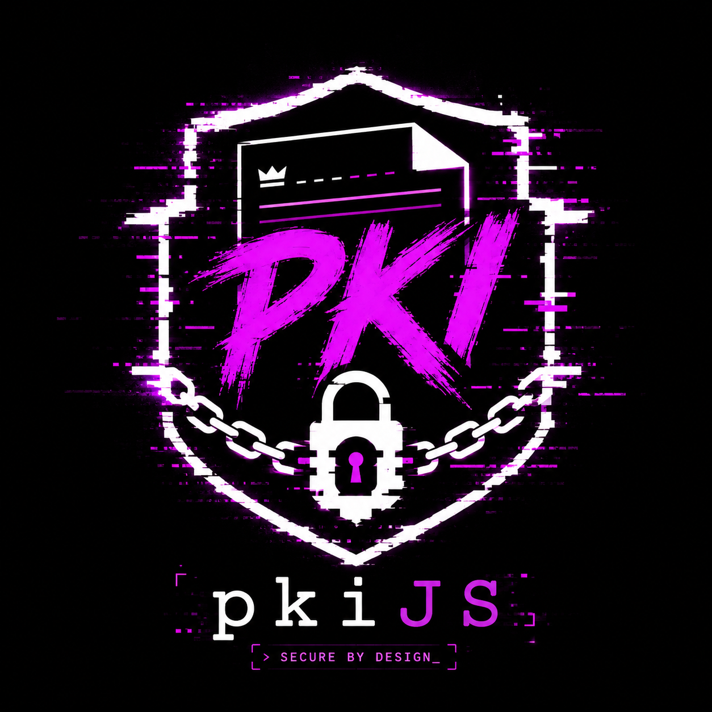

<div align="center">



# @blamejs/pki

**A pure-JavaScript PKI toolkit that owns its stack.**

X.509, ASN.1/DER, OID, CMS, OCSP, timestamping, and PKCS formats — with an
in-house, fail-closed DER codec and a post-quantum-first algorithm registry.
No npm runtime dependencies. No TypeScript. No Web Crypto ceiling.

[](https://www.npmjs.com/package/@blamejs/pki)
[](https://www.apache.org/licenses/LICENSE-2.0)
[](https://nodejs.org)
[](#security-posture)
[](#security-posture)

[pkijs.com](https://pkijs.com) · [Roadmap](ROADMAP.md) · [Security](SECURITY.md) · [Changelog](CHANGELOG.md)

</div>

---

## Why this toolkit

Most JavaScript PKI code inherits its ASN.1 parser and its algorithm coverage
from somewhere else — an external DER library with its own CVE history, or the
Web Crypto API with its limits on streaming, opaque keys, and algorithm reach.
`@blamejs/pki` owns those layers:

- **Its own DER codec.** Strict, canonical, bounded. Malformed input is rejected
  in bounded time, not walked into a stack overflow.
- **An OID-named algorithm registry.** Every algorithm, attribute, and extension
  is named through one two-way OID table (`pki.oid`), so a new signature or KEM
  algorithm — including a post-quantum one — is a registry entry, not a special
  case in `parse`. OID-driven sign/verify resolution rides the same table as the
  signing surface lands.
- **Fail-closed everywhere.** Every parse, sign, and verify path throws on
  failure. No path returns zero, a default, or partial output in place of a real
  verdict.
- **Zero dependencies in your `package.json`.** The cryptography runs on Node's
  built-in `node:crypto` — the full classical set plus post-quantum ML-DSA and
  SLH-DSA signatures via the platform OpenSSL 3.5. ML-KEM key generation is
  available today, with KEM encapsulation on the roadmap. Nothing is vendored,
  nothing is installed; `npm audit` has nothing to say because there is no
  dependency tree.

## Install

```sh
npm i @blamejs/pki
```

Requires Node.js 24.18+ (runs on the shipped runtime — no build step, no
transpilation).

```js
var pki = require("@blamejs/pki");
```

## Quickstart

### Parse an X.509 certificate

`pki.schema.x509.parse` accepts a DER `Buffer` or a PEM string/Buffer and returns a
fully-decoded, validated certificate — distinguished names rendered and
structured, the validity window as real `Date`s, algorithms and extensions
named through the OID registry, and the exact signed `tbsBytes` for a downstream
verifier.

```js
var pki = require("@blamejs/pki");
var fs  = require("node:fs");

var pem  = fs.readFileSync("cert.pem", "utf8");
var cert = pki.schema.x509.parse(pem);

cert.subject.dn;                    // "CN=example.com, O=Example Org, C=US"
cert.issuer.dn;                     // "CN=example.com, O=Example Org, C=US"
cert.serialNumberHex;              // "7057e1ebeec2e5f7…"
cert.signatureAlgorithm.name;      // "sha256WithRSAEncryption"
cert.subjectPublicKeyInfo.algorithm.name;  // "rsaEncryption"
cert.validity.notAfter;            // Date — 2027-07-04T07:16:15.000Z

cert.extensions.forEach(function (ext) {
  ext.name;      // "subjectKeyIdentifier" (or null when the OID is unknown)
  ext.critical;  // boolean
  ext.value;     // Buffer — the raw extnValue OCTET STRING contents
});
```

Malformed bytes throw a typed error rather than returning a half-parsed object:

```js
try {
  pki.schema.x509.parse(Buffer.from([0x30, 0x03, 0x02, 0x01, 0x00]));
} catch (e) {
  e.constructor.name;  // "CertificateError"
  e.code;              // e.g. "x509/not-a-certificate" — stable domain/reason string
}
```

### Convert PEM ↔ DER

```js
var der = pki.schema.x509.pemDecode(pem, "CERTIFICATE");   // Buffer of DER bytes
var out = pki.schema.x509.pemEncode(der, "CERTIFICATE");   // 64-column PEM string
```

### Decode and build ASN.1 / DER directly

The codec under every structure is public. Decode returns a zero-copy node tree;
the builders emit canonical DER.

```js
// Build a canonical-DER SEQUENCE, then decode it back.
var der = pki.asn1.build.sequence([
  pki.asn1.build.oid("2.5.4.3"),          // commonName
  pki.asn1.build.utf8("example.com"),
]);

var node = pki.asn1.decode(der);
node.tagNumber === pki.asn1.TAGS.SEQUENCE;   // true
node.children.length;                        // 2
pki.asn1.read.oid(node.children[0]);         // "2.5.4.3"
pki.asn1.read.string(node.children[1]);      // "example.com"
```

The decoder is strict by construction — non-DER shapes are refused, not
tolerated:

```js
try {
  pki.asn1.decode(Buffer.from([0x30, 0x80, 0x00, 0x00]));  // indefinite length
} catch (e) {
  e.constructor.name;  // "Asn1Error"
  e.code;              // "asn1/indefinite-length"
}
```

Size and depth are bounded before a byte is walked; override the caps per call
when you need to:

```js
pki.asn1.decode(der, { maxBytes: pki.C.BYTES.mib(4), maxDepth: 32 });
```

### Resolve object identifiers

Every algorithm, attribute type, and extension is named by an OID. The registry
is a two-way map, seeded with the RFC 5280 set, the classical algorithm set, and
the NIST post-quantum arcs (ML-DSA, ML-KEM, SLH-DSA).

```js
pki.oid.name("1.2.840.113549.1.1.11");  // "sha256WithRSAEncryption"
pki.oid.byName("sha256");               // "2.16.840.1.101.3.4.2.1"
pki.oid.toArcs("2.5.4.3");              // [2, 5, 4, 3]

// Extend it with your own arc:
pki.oid.register("1.3.6.1.4.1.99999.1", "acmeCorpExtension");
```

### Sign with post-quantum ML-DSA — or any classical algorithm

`pki.webcrypto` is a standard W3C WebCrypto (`SubtleCrypto`) engine over
`node:crypto`. The post-quantum suite lives in the same API as RSA, ECDSA, and
EdDSA — pick the algorithm, the rest is identical:

```js
var subtle = pki.webcrypto.subtle;
var data   = Buffer.from("sign me");

// FIPS 204 ML-DSA-65 — a post-quantum signature.
var kp  = await subtle.generateKey({ name: "ML-DSA-65" }, true, ["sign", "verify"]);
var sig = await subtle.sign({ name: "ML-DSA-65" }, kp.privateKey, data);
var ok  = await subtle.verify({ name: "ML-DSA-65" }, kp.publicKey, sig, data); // true

// The classical set — ECDSA, RSA-PSS, Ed25519, AES-GCM, ECDH, HKDF, … — is the
// same call shape, and every key it exports is OpenSSL/NSS-interoperable.
```

## What ships today

The core codec and certificate-reading surface are here and stable. Everything
is callable today; nothing below is a stub.

| Namespace | What it does |
|---|---|
| `pki.asn1` | Strict, bounded DER codec — `decode` (zero-copy node tree), `encode`, `build.*` canonical-DER value builders, `read.*` typed readers, `TAGS`, OID-content encode/decode |
| `pki.oid` | Two-way OID ↔ name registry — `name`, `byName`, `register`, `toArcs`/`fromArcs`, `toDER`/`fromDER`; seeded with RFC 5280 + NIST PQC arcs |
| `pki.webcrypto` | A W3C WebCrypto (`SubtleCrypto`) engine over `node:crypto` — `sign`/`verify`/`encrypt`/`decrypt`/`deriveBits`/`digest`/`generateKey`/`importKey`/`exportKey` across RSA, ECDSA, ECDH, Ed25519/Ed448, AES, HMAC, HKDF, PBKDF2, SHA — **and** post-quantum ML-DSA-44/65/87 and SLH-DSA signatures, plus ML-KEM-512/768/1024 key generation (KEM encapsulation on the roadmap). Zero-dependency, OpenSSL-interoperable |
| `pki.schema` | The schema family — `parse` detects which PKI format DER / PEM encodes and routes to the right parser, `all` enumerates the registered formats, and the engine + per-format members are grouped here |
| `pki.schema.x509` | Parse DER / PEM certificates into structured, validated fields — `parse`, `pemDecode`, `pemEncode` |
| `pki.schema.crl` | Parse DER / PEM X.509 CRLs per RFC 5280 §5 — revoked serials with real-`Date` revocation times, named + partly-decoded extensions, fail-closed — `parse`, `pemDecode` |
| `pki.schema.engine` | The declarative ASN.1 structure-schema engine every format parser composes — `walk` plus the schema combinators |
| `pki.C` / `pki.constants` | Version-stable constants — functional scale helpers (`C.TIME.*`, `C.BYTES.*`), codec `LIMITS`, `version` |
| `pki.errors` | The `PkiError` taxonomy — `defineClass` plus `ConstantsError` / `Asn1Error` / `OidError` / `PemError` / `CertificateError` / `CrlError`, each carrying a stable `code` in `domain/reason` form |
| `pki` CLI | `pki version`, `pki oid <dotted\|name>`, `pki parse <cert>` |

### CLI

```sh
pki version                              # @blamejs/pki v0.1.0
pki oid 1.2.840.113549.1.1.11           # sha256WithRSAEncryption
pki oid sha256                           # 2.16.840.1.101.3.4.2.1
pki parse cert.pem                       # structured JSON summary of a certificate
```

### What's coming

Certificate build/sign/verify, CRLs, CSRs (PKCS#10), certification-path
validation, CMS (SignedData / EnvelopedData / EncryptedData / AuthenticatedData),
OCSP, RFC 3161 timestamping, PKCS#8 / SPKI / PBES2 / PKCS#12, and the
post-quantum certificate and CMS surface (ML-DSA / ML-KEM / SLH-DSA and hybrid
composites) are on the roadmap and ride this same core. See
[ROADMAP.md](ROADMAP.md) for the full plan and current status of each area, and
[CHANGELOG.md](CHANGELOG.md) for what has landed.

## Security posture

- **Zero npm runtime dependencies, nothing vendored.** The cryptography runs on
  Node's built-in `node:crypto`; the toolkit vendors no third-party code — a
  platform built-in ships zero bytes and stays OpenSSL-interoperable by
  construction. There is no dependency tree, transitive or vendored, to
  compromise or keep current.
- **Fail-closed DER.** The decoder rejects every non-canonical shape — indefinite
  length, non-minimal length or tag encodings, trailing bytes, over-long or
  over-deep input — with a typed `Asn1Error` before it walks the structure. Size
  and depth caps are enforced up front, so adversarial input is bounded work, not
  a stack overflow.
- **Fail-closed verification.** Every verify path throws on failure. A default
  that accepts-on-error is treated as a bug, not an ergonomic.
- **PQC-first crypto.** Post-quantum ML-DSA and SLH-DSA signatures run in the
  WebCrypto engine (`pki.webcrypto`) alongside the classical set today, and
  ML-KEM key generation is available with KEM encapsulation on the roadmap.
  Every algorithm is named in the OID registry (`pki.oid`); OID-driven
  sign/verify resolution rides that registry as the signing surface lands, and
  there is no classical-only default where a post-quantum option exists.
- **Signed releases.** Release tags are annotated and SSH-signed; published
  tarballs carry provenance and an SBOM. See
  [SECURITY.md → Verifying release authenticity](SECURITY.md#verifying-release-authenticity).

Report a vulnerability privately — see [SECURITY.md](SECURITY.md). For usage
questions and support channels, see [SUPPORT.md](SUPPORT.md).

## Documentation

Full primitive-by-primitive reference lives at [pkijs.com](https://pkijs.com),
generated from the source comment blocks so it cannot drift from the shipped API.

## License

[Apache-2.0](LICENSE). Third-party attribution — currently none, since the
toolkit vendors nothing — is tracked in [NOTICE](NOTICE).
