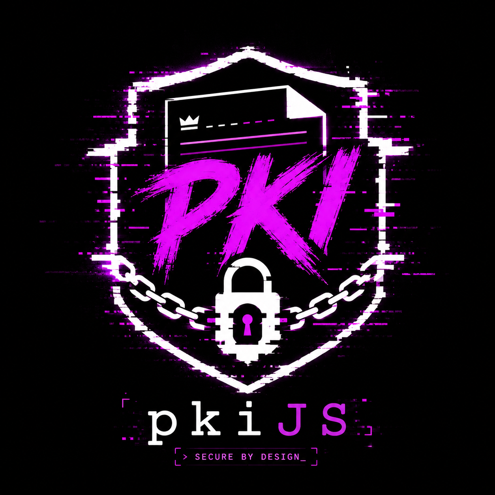

<div align="center">



# @blamejs/pki

**PKI in pure JavaScript, with its own ASN.1 codec and crypto engine.**

X.509, ASN.1/DER, OID, CMS, OCSP, CRL, timestamping, enrollment, and the PKCS
formats. The fail-closed DER codec and the post-quantum-first algorithm registry
are in-tree and public, so strictness and algorithm coverage are decisions this
toolkit makes rather than inherits, and neither is capped by what Web Crypto
exposes. No runtime dependencies, no TypeScript, no build step.

[](https://www.npmjs.com/package/@blamejs/pki)
[](https://www.npmjs.com/package/@blamejs/pki)
[](https://www.apache.org/licenses/LICENSE-2.0)
[](https://nodejs.org)

[](https://github.com/blamejs/pki/actions/workflows/ci.yml)
[](https://github.com/blamejs/pki/actions/workflows/codeql.yml)
[](https://github.com/blamejs/pki/actions/workflows/cflite_batch.yml)
[](https://scorecard.dev/viewer/?uri=github.com/blamejs/pki)
[](https://www.bestpractices.dev/projects/13562)
[](https://slsa.dev/spec/v1.0/levels#build-l3)

[](#security-posture)
[](#security-posture)
[](#why-this-toolkit)
[](#security-posture)

[pkijs.com](https://pkijs.com) · [Roadmap](ROADMAP.md) · [Security](SECURITY.md) · [Changelog](CHANGELOG.md)

</div>

---

## Why this toolkit

Most JavaScript PKI code gets its ASN.1 parser and its algorithm coverage from
somewhere else: an external DER library with its own CVE history, or the Web
Crypto API with its limits on streaming, opaque keys, and algorithm reach.
`@blamejs/pki` owns those layers.

- **Its own DER codec.** Strict, canonical, and bounded. Malformed input is
  rejected in bounded time rather than walked into a stack overflow.
- **An OID-named algorithm registry.** Every algorithm, attribute, and extension
  is named through one two-way OID table (`pki.oid`). Adding a signature or KEM
  algorithm, post-quantum ones included, is a registry entry rather than a case
  in `parse`. Sign and verify resolve algorithms through the same table the
  parsers read.
- **Fail-closed everywhere.** Every parse, sign, and verify path throws on
  failure. No path returns zero, a default, or partial output in place of a
  verdict.
- **Nothing in your `package.json`.** The cryptography runs on Node's built-in
  `node:crypto`: the classical set plus post-quantum ML-DSA and SLH-DSA
  signatures via the platform OpenSSL 3.5, and ML-KEM key generation,
  encapsulation, and decapsulation. Nothing is vendored and nothing is
  installed, so there is no dependency tree for `npm audit` to report on.

## Install

```sh
npm i @blamejs/pki
```

Requires Node.js 24.19+ and runs on the shipped runtime, with no build step and
no transpilation.

```js
var pki = require("@blamejs/pki");
```

## Quickstart

### Parse an X.509 certificate

`pki.schema.x509.parse` accepts a DER `Buffer` or a PEM string or Buffer. It
returns a fully decoded, validated certificate: distinguished names rendered and
structured, the validity window as real `Date`s, algorithms and extensions named
through the OID registry, and the exact signed `tbsBytes` for a downstream
verifier.

```js
var pki = require("@blamejs/pki");
var fs  = require("node:fs");

var pem  = fs.readFileSync("cert.pem", "utf8");
var cert = pki.schema.x509.parse(pem);

cert.subject.dn;                    // "CN=example.com, O=Example Org, C=US"
cert.issuer.dn;                     // "CN=example.com, O=Example Org, C=US"
cert.serialNumberHex;              // "7057e1ebeec2e5f7…"
cert.signatureAlgorithm.name;      // "sha256WithRSAEncryption"
cert.subjectPublicKeyInfo.algorithm.name;  // "rsaEncryption"
cert.validity.notAfter;            // Date — 2027-07-04T07:16:15.000Z

cert.extensions.forEach(function (ext) {
  ext.name;      // "subjectKeyIdentifier" (or null when the OID is unknown)
  ext.critical;  // boolean
  ext.value;     // Buffer — the raw extnValue OCTET STRING contents
});
```

Malformed bytes throw a typed error rather than returning a half-parsed object:

```js
try {
  pki.schema.x509.parse(Buffer.from([0x30, 0x03, 0x02, 0x01, 0x00]));
} catch (e) {
  e.constructor.name;  // "CertificateError"
  e.code;              // e.g. "x509/not-a-certificate" — stable domain/reason string
}
```

### Convert PEM ↔ DER

```js
var der = pki.schema.x509.pemDecode(pem, "CERTIFICATE");   // Buffer of DER bytes
var out = pki.schema.x509.pemEncode(der, "CERTIFICATE");   // 64-column PEM string
```

### Decode and build ASN.1 / DER directly

The codec under every structure is public. Decode returns a zero-copy node tree,
and the builders emit canonical DER.

```js
// Build a canonical-DER SEQUENCE, then decode it back.
var der = pki.asn1.build.sequence([
  pki.asn1.build.oid("2.5.4.3"),          // commonName
  pki.asn1.build.utf8("example.com"),
]);

var node = pki.asn1.decode(der);
node.tagNumber === pki.asn1.TAGS.SEQUENCE;   // true
node.children.length;                        // 2
pki.asn1.read.oid(node.children[0]);         // "2.5.4.3"
pki.asn1.read.string(node.children[1]);      // "example.com"
```

The decoder is strict by construction, so non-DER shapes are refused:

```js
try {
  pki.asn1.decode(Buffer.from([0x30, 0x80, 0x00, 0x00]));  // indefinite length
} catch (e) {
  e.constructor.name;  // "Asn1Error"
  e.code;              // "asn1/indefinite-length"
}
```

Size and depth are bounded before a byte is walked. Override the caps per call:

```js
pki.asn1.decode(der, { maxBytes: pki.C.BYTES.mib(4), maxDepth: 32 });
```

### Resolve object identifiers

An OID names every algorithm, attribute type, and extension. The registry
is a two-way map, seeded with the RFC 5280 set, the classical algorithm set, and
the NIST post-quantum arcs (ML-DSA, ML-KEM, SLH-DSA).

```js
pki.oid.name("1.2.840.113549.1.1.11");  // "sha256WithRSAEncryption"
pki.oid.byName("sha256");               // "2.16.840.1.101.3.4.2.1"
pki.oid.toArcs("2.5.4.3");              // [2, 5, 4, 3]

// Extend it with your own arc:
pki.oid.register("1.3.6.1.4.1.99999.1", "acmeCorpExtension");
```

### Sign with post-quantum ML-DSA, or any classical algorithm

`pki.webcrypto` is a standard W3C WebCrypto (`SubtleCrypto`) engine over
`node:crypto`. The post-quantum suite lives in the same API as RSA, ECDSA, and
EdDSA: pick the algorithm, and the rest is identical.

```js
var subtle = pki.webcrypto.subtle;
var data   = Buffer.from("sign me");

// FIPS 204 ML-DSA-65 — a post-quantum signature.
var kp  = await subtle.generateKey({ name: "ML-DSA-65" }, true, ["sign", "verify"]);
var sig = await subtle.sign({ name: "ML-DSA-65" }, kp.privateKey, data);
var ok  = await subtle.verify({ name: "ML-DSA-65" }, kp.publicKey, sig, data); // true

// The classical set — ECDSA, RSA-PSS, Ed25519, AES-GCM, ECDH, HKDF, … — is the
// same call shape, and every key it exports is OpenSSL/NSS-interoperable.
```

## What ships today

Everything below is callable now; nothing is a stub. The whole documented
surface is stable under the deprecation policy: a deprecation warning ships at
least one minor release before any removal, and a minor release makes no silent
breaking change. Each primitive's `@status` appears on its wiki page, and
[LTS-CALENDAR.md](LTS-CALENDAR.md) explains the status lifecycle. The
table is an index — the per-function reference, generated from the source
comment blocks, is at [pkijs.com](https://pkijs.com).

| Namespace | What it does |
|---|---|
| `pki.asn1` | Strict, bounded DER codec. `decode` returns a zero-copy node tree, `build.*` emits canonical DER values, `read.*` are typed leaf readers. Plus `encode`, `TAGS`, OID content encode/decode, and the `isPrintableString` string predicate |
| `pki.cbor` | Strict, bounded deterministic CBOR codec (RFC 8949). `decode` returns a zero-copy node tree, plus `read.*` typed leaf readers including the keyed lookup `read.mapGet` (text or COSE-label integer key, with the map's major type asserted in the accessor). Fail-closed on every non-canonical shape: indefinite length, non-minimal argument, unsorted or duplicate map keys, non-shortest float, trailing bytes |
| `pki.oid` | Two-way OID ↔ name registry, seeded with RFC 5280 and the NIST PQC arcs — `name`, `byName`, `register`, `toArcs`/`fromArcs`, `toDER`/`fromDER`, and the `isDottedDecimal` string predicate |
| `pki.webcrypto` | A W3C `SubtleCrypto` engine over `node:crypto` — `sign`/`verify`/`encrypt`/`decrypt`/`deriveBits`/`digest`/`generateKey`/`importKey`/`exportKey` across RSA, ECDSA, ECDH, Ed25519/Ed448, AES, HMAC, HKDF, PBKDF2 and SHA, plus post-quantum ML-DSA-44/65/87, SLH-DSA, and ML-KEM-512/768/1024 key generation with certificate and PKCS#8 import. The RFC 9935 seed / expandedKey / both private-key CHOICE is validated fail-closed, so an OpenSSL-legacy bare seed or an internally inconsistent key is rejected with a typed error. `encapsulateBits` and `decapsulateBits` are the ML-KEM key-establishment pair the CMS `KEMRecipientInfo` arm rides on, with the FIPS 203 §7.3 ciphertext-length check enforced here so a direct caller inherits it. Cross-implementation use is undefined in the specification, so a `CryptoKey` from a different WebCrypto implementation is refused here with a typed fault naming its origin; the `pki.*` verbs adopt such a key instead, whether it came from the platform or from a separately installed copy of this toolkit |
| `pki.tls` | RFC 8879 certificate compression and the RFC 8446 §4.4.2 Certificate message it carries, which is the handshake's largest payload. `decompressCertificate` decodes a `CompressedCertificate` and returns the algorithm, the declared uncompressed length, the recovered message raw, and its per-entry certificate DER. Decompression carries the two-sided bound §5 requires: capped at the message's own declared length so a bomb is refused mid-stream, then compared to that declaration exactly, which catches the under-length direction a cap alone cannot see. An algorithm outside the RFC 8879 registry, one the runtime cannot decompress, or one the receiver never advertised is refused before any decompressor is handed the bytes; an empty compressed body is a framing violation (`tls/bad-framing`); and trailing bytes, after the message or after the compressed frame, are refused (`tls/trailing-data`), so one chain has exactly one encoding. `compressCertificate` is the inverse and round-trips its own output before returning. `parseCertificateMessage` decodes the RFC 8446 §4.4.2 message on its own, surfacing each entry's certificate DER ready for `pki.schema.x509.parse` alongside its raw extensions; a separate extension negotiates `certificate_type`, so it is declared, never guessed. All three registered algorithms (zlib, brotli, zstd) are implemented, each offered only where the running Node decompresses it safely — one whose decompressor answers a truncated frame with a short result instead of a fault is dropped at startup rather than advertised with a truncation it cannot detect. Structure only: no handshake is spoken and no certificate verified — `decompressCertificate`, `compressCertificate`, `parseCertificateMessage` |
| `pki.schema` | The schema family. `parse` detects which PKI format a DER or PEM input encodes and routes it to the right parser; `all` enumerates the registered formats; the engine and per-format members are grouped here |
| `pki.schema.x509` | Certificates (RFC 5280) parsed into structured, validated fields with named and partly decoded extensions, including the RFC 3739 / ETSI EN 319 412-5 qualified-certificate `qcStatements` (EU-qualified declaration, reliance limit, QSCD flag, certificate type, retention, PDS URLs, country of qualification) and the Microsoft Active Directory Certificate Services enrollment extensions (certificate template, CA version, previous-CA-certificate hash, application policies). Unknown statements stay opaque, fail-closed Fail-closed — `parse`, `pemDecode`, `pemEncode` |
| `pki.schema.c509` | C509 certificates (draft-ietf-cose-cbor-encoded-cert), the compact CBOR profile of X.509, decoded fail-closed under deterministic CBOR. `encode` is the byte-exact inverse: a DER X.509 v3 certificate forward-transforms to a compact type-3 C509 whose reconstruction reproduces the original DER byte for byte, so the original signature still verifies. A `parse` result re-emits its native array in canonical deterministic CBOR, with the registry integer shorthands, the C509 compressions, and the compact draft-20 per-extension value forms: the scalar extensions (keyUsage, basicConstraints, extended key usage, subject key identifier, inhibitAnyPolicy, OCSP No Check, TLS Feature), the general-name-bearing extensions (subjectAltName, issuer alternative name, name constraints, CRL distribution points, freshest CRL, authority and subject information access, and the full authority key identifier) over one shared GeneralNames codec, certificate policies with their CPS-URI and UserNotice qualifiers, policy mappings and policy constraints, subject directory attributes, and the RFC 3779 resource-delegation extensions (IP address blocks and AS identifiers) with their RFC 8360 v2 twins, whose addresses ride either the delta-coded integer form or the byte-string form the specification mandates once an address exceeds eight octets. A value the compact form cannot carry exactly falls back to the byte-string form with its bytes intact; a certificate outside the invertible set throws a typed `C509Error`. Called explicitly, since it is CBOR rather than DER and so is not auto-routed |
| `pki.schema.crl` | X.509 CRLs (RFC 5280 §5): revoked serials with real-`Date` revocation times, named and partly decoded extensions Fail-closed — `parse`, `pemDecode`, `pemEncode` |
| `pki.schema.csr` | PKCS#10 certification requests (RFC 2986): subject DN, public key, requested attributes, signature Fail-closed — `parse`, `pemDecode`, `pemEncode` |
| `pki.schema.pkcs8` | PKCS#8 private keys (RFC 5208 / 5958): algorithm, raw key bytes, attributes, optional public key. Encrypted keys are recognized but not decrypted. Fail-closed — `parse`, `parseEncrypted`, `pemDecode`, `pemEncode` |
| `pki.schema.cms` | CMS (RFC 5652 / 5083 / 9629): SignedData (§5, signer infos plus raw signed-attribute bytes for external verification), EnvelopedData (§6, all five RecipientInfo kinds including RFC 5753 key agreement and RFC 9629 KEM recipients with ML-KEM validation), EncryptedData (§8), AuthenticatedData (§9, MAC surface plus raw `authAttrsBytes`), and AuthEnvelopedData (RFC 5083, with RFC 5084 AES-GCM/CCM parameter validation). §11 attribute placement is enforced, countersignatures validate recursively, certificates and CRLs are validated against the closed CHOICE sets and kept raw, and every result is tagged `contentTypeName` Fail-closed — `parse`, `pemDecode`, `pemEncode` |
| `pki.schema.ocsp` | OCSP requests and responses (RFC 6960): per-certificate status (good, revoked, unknown), responder identity, raw tbs bytes for external verification, certificates kept raw. Non-basic response types are recognized but not decoded. Fail-closed — `parseRequest`, `parseResponse`, `pemDecode`, `pemEncode` |
| `pki.schema.tsp` | RFC 3161 timestamp requests, responses, and tokens: the TimeStampReq a client sends (imprint, requested policy, nonce, certReq), the TSTInfo payload (imprint, genTime with sub-second precision, serial, nonce, accuracy), the status-to-token coupling, and the token wrapper composed over CMS with the single-signer rule. Fail-closed — `parse`, `parseRequest`, `parseResponse`, `parseTstInfo`, `parseToken`, `pemDecode`, `pemEncode` |
| `pki.schema.attrcert` | Attribute certificates (RFC 5755): holder and issuer identities as validated GeneralNames, the validity window as real `Date`s, and the privilege attributes and extensions decoded to structured values (role, clearance, service and access identity, group, charging identity; audit identity, target and proxy information, no-rev-avail, AA controls), with the raw signed region for a verifier. Unknown types stay opaque, and the obsolete v1 form is recognized and deferred Fail-closed — `parse`, `pemDecode`, `pemEncode` |
| `pki.schema.crmf` | Certificate request messages (RFC 4211) — the CMP and EST enrollment body. The requested-certificate template (subject, public key, validity, extensions), proof of possession, and registration controls, with the raw `CertRequest` region surfaced for the caller to hash. Names are dual-accepted, IMPLICIT and EXPLICIT. This toolkit ships no proof-of-possession verifier yet, so confirming that a requester holds the key it asks to have certified remains the CA's own step Fail-closed — `parse`, `pemDecode`, `pemEncode` |
| `pki.schema.pkcs12` | PKCS#12 (PFX) stores (RFC 7292) from DER, BER, or PEM: key bags via the PKCS#8 parser, shrouded keys with the algorithm surfaced and the ciphertext opaque, cert / CRL / secret bags raw and byte-exact, encrypted and enveloped safes structurally via CMS, `friendlyName` and `localKeyId` decoded, and the exact MAC byte range (`macedBytes`) plus RFC 9579 PBMAC1 recognition for external verification. BER is accepted exactly where §4.1 requires it Fail-closed — `parse`, `pemDecode`, `pemEncode` |
| `pki.schema.cmp` | CMP messages (RFC 9810): the header (version, sender and recipient including the anonymous NULL-DN, nonces, transaction id, general info), the 27-arm body (certificate requests via the CRMF parser, an encrypted certificate's EnvelopedData via CMS, response / revocation / confirmation / error / support / polling arms structural, the rest raw), and the exact `headerBytes` and `bodyBytes` slices an external verifier reconstructs the protected part from. The CMP-before-OCSP dispatch order is enforced Fail-closed — `parse`, `pemDecode`, `pemEncode` |
| `pki.schema.csrattrs` | EST CSR Attributes (`CsrAttrs`, RFC 8951 §3.5 / RFC 9908) — the `AttrOrOID` items a server sends to shape an enrollment: bare OIDs, attributes with raw values, and decoded views of the RFC 9908 meaningful types (extension requests, EC and RSA key-type conventions, the certification-request-info template). Unknown types are surfaced raw; structure and the RFC 9908 semantic MUSTs are fail-closed — `parse` |
| `pki.est` | Enrollment over Secure Transport (RFC 7030 / 8951 / 9908 / 7616). The client verbs `cacerts`, `simpleenroll`, `simplereenroll`, `serverkeygen`, `csrattrs`, and `fullcmc` drive the RFC 7030 flow over `pki.transport` (inject your own via `opts.transport`, or take the fail-closed default): HTTPS only, an explicit trust anchor required, same-origin redirects followed while a downgrade or loop is refused, a 202 Retry-After surfaced but never slept, HTTP Basic or Digest (RFC 7616, SHA-256 / SHA-512-256; MD5 and no-qop refused by default) answered only after the server is authenticated, and the issued certificate chosen by public-key match. `serverkeygen` requests a server-generated key, cleartext or an opaque CMS EnvelopedData, with encryption bound to the CSR's key-identifier attribute over a confidentiality-bearing cipher. `csrattrs` fetches the CA's RFC 9908 attributes policy. `fullcmc` (§4.3) carries a CMC Full PKI Request and reduces the CA's answer through `pki.cmc.verify` to one terminal outcome, refusing a response that fails to echo the transaction and nonce the request carried, or that covers a key the request never asked for; a certs-only reply to a bound request is refused rather than read as an issuance. Under the verbs sit the transport-agnostic codecs they compose: the RFC 8951 base64 transfer codec (which ignores Content-Transfer-Encoding), the `multipart/mixed` splitter, the certs-only and serverkeygen response validators over CMS, the enroll-attribute builders, and the HTTP response classifier — `transferDecode`/`transferEncode`, `parseCertsOnly`, `splitMultipartMixed`, `parseServerKeygenResponse`, `findIssuedCert`, `classifyResponse`, `paths`, and the builders |
| `pki.scep` | SCEP pkiMessage codec (RFC 8894), the client side of Simple Certificate Enrollment. `build(spec)` assembles a `PKCSReq` or `RenewalReq` request: it verifies the PKCS#10 certification request's own proof-of-possession, encrypts it to the CA as the inner EnvelopedData (`pkcsPKIEnvelope`, AES-128-CBC), and signs that under the transaction attributes RFC 8894 §3.2 defines, a messageType, a caller-unique transactionId, and a 16-byte senderNonce. The recipient CA certificate must assert `keyEncipherment`. `parse(bytes, opts?)` reads a `PKCSReq`, `RenewalReq`, or `CertRep` back (the `CertPoll`, `GetCert`, and `GetCRL` client queries are refused): it verifies the outer signature first and refuses a message whose signature does not check, so the transaction attributes it returns come only from a verified signer, never alongside a false verdict. Because a valid signature only proves self-consistency with the embedded certificate, pass `opts.signerCert` to authenticate a CA response against the CA certificate you hold (a public-key mismatch is refused, `signerAuthenticated` reports the result); a caller that omits it gets a crypto-only verdict and must authenticate the surfaced `signerCert` itself. It maps the messageType, pkiStatus, failInfo, and the nonces from their RFC 8894 enumerants and refuses an unknown one; given `recipientKey` it decrypts the `pkcsPKIEnvelope` to the messageData, and given `expectedSenderNonce` it refuses a response whose recipientNonce does not echo it. It reads a CA's CertRep in full. `getCACaps(baseUrl, opts?)`, `getCACert(baseUrl, opts?)`, `enroll(baseUrl, opts)`, and `renew(baseUrl, opts)` carry that codec to a live CA over HTTP (RFC 8894 §4) through an injectable transport (`pki.transport.https` by default): `getCACaps` reports the CA's advertised capabilities and never lowers the client's algorithm choice on the unauthenticated response, `getCACert` pins the CA certificate to an out-of-band `expectedFingerprint` a returned certificate must match, and `enroll` and `renew` POST a PKCSReq or RenewalReq, authenticate the CertRep against the CA certificate and its nonce echo, select the issued certificate by public-key match, throw on a FAILURE with the CA's failInfo, and return a PENDING to retry. Issuing a CertRep, `GetNextCACert`, and automatic polling are not yet built — `build`, `parse`, `getCACaps`, `getCACert`, `enroll`, `renew` |
| `pki.transport` | The shared, fail-closed `node:https` transport the enrollment clients drive. `pki.transport.https(defaults)` returns a `transport(request) → { status, headers, body, tls }`, where `tls` carries the negotiated `protocol`, `cipher`, and raw `peerCertificate`. This is the toolkit's only socket choke point: an explicit trust anchor (or an opt-in to the system store) is required, `rejectUnauthorized` is always on, TLS is floored at 1.2, the response body is capped while it streams, and a stalled socket times out. The EST, ACME, and CMP clients reuse it verbatim. If you inject your own transport, return `tls` too: `pki.est.serverkeygen` asserts the negotiated cipher can protect the delivered private key, and a transport that reports no cipher is trusted rather than refused, so omitting the field silently skips that check — `https` |
| `pki.jose` | Flattened JWS (RFC 7515) and JWK thumbprints (RFC 7638). `sign` and `verify` run a Flattened JWS against declarative profiles (ACME outer, EAB inner, keyChange inner) that carry the required and forbidden header rules as data. `base64url` is the strict RFC 4648 §5 codec, rejecting padding, non-alphabet characters, and non-canonical trailing bits. `parseJson` is a bounded reader that refuses duplicate members at any depth. `thumbprint` is the RFC 7638 / 8037 / 9964 canonical digest. The algorithm registry binds each `alg` to its key type (ES/RS/PS/EdDSA/ML-DSA), leaving no code path for `alg:none`, an RS256→HS256 key confusion, or an all-zero ECDSA signature; `assertPublicJwk` refuses a JWK carrying private material, so an exported private key is never published. `opts.key` names the key a message must be signed under and governs: where the profile also permits an embedded header `jwk`, the two must be the same key — compared as RFC 7638 thumbprints, so member order cannot make equal keys differ — and a disagreement is refused rather than resolved in the message's favor. `keySource` reports which key answered, since a signature checked against a key you named is a different claim from one checked against the key the message carried — `sign`, `verify`, `base64url`, `parseJson`, `thumbprint`, `assertPublicJwk` |
| `pki.acme` | ACME (RFC 8555 / 8737 / 8738 / 9773). `client(directoryUrl, opts)` is a stateful client driving a live CA directory over `pki.transport`: `newAccount`, `newOrder`, `newAuthz`, `getOrder`, `getAuthorization`, `getChallenge`, `respondToChallenge`, `finalize`, `pollOrder`, `pollAuthorization`, and `downloadCertificate` walk the issuance flow, with `newAuthz` pre-authorizing a single identifier (§7.4.1) and `downloadCertificate` binding the issued certificate to the order — its key, its identifiers, or both; at least one is required by default and the result reports `boundToKey` / `boundToIdentifiers` — before choosing among alternate chains (`Link rel="alternate"`, §7.4.2, via a `selectChain` predicate bounded by `maxAlternates`). `revokeCert` (account-key or certificate-key signed), `keyChange`, `updateAccount` (change the account contacts, §7.3.2), `listOrders` (the account's orders list, following the §7.1.2.1 `Link rel="next"` pagination bounded by a page cap and confined to the orders origin), `deactivateAccount`, `deactivateAuthorization`, `renewalInfo` (ARI), and `renewalWindow` (the RFC 9773 §4.2/4.3 renewal decision) complete the lifecycle. Every URL is HTTPS only, an explicit trust anchor is required, each request carries a fresh single-use nonce with a bounded badNonce retry (and, when `opts.resignKeys` supplies caller-approved alternative account-key algorithms, a bounded RFC 8555 §6.2 badSignatureAlgorithm re-sign that the CA's advertised list can only filter, never widen, so it cannot force a weaker algorithm), reads are POST-as-GET, polling is bounded and sleeps on a Retry-After via an injectable sleeper capped by a poll count and a total-wait budget, and every response body is size-capped. The transport is injectable via `opts.transport`. Over the message layer it composes resource-object validators (closed status enums, conditional-required fields, unknown fields ignored), the three §7.1.6 state machines, the request builders (newAccount with External Account Binding, newOrder with `replaces`, finalize with a CSR identifier-set match and account-key-reuse rejection, challenge responses, deactivation, revokeCert in both key modes, the keyChange nested JWS, POST-as-GET), the http-01 / dns-01 / tls-alpn-01 challenge computations, the dns and ip identifier validators, and the ARI certID with serial sign-padding preserved — `client`, `validate`, `identify`, `assertTransition`, the builders, `keyAuthorization`, `http01`, `dns01`, `tlsAlpn01Extension`, `verifyTlsAlpn01`, `ariCertId` |
| `pki.schema.smime` | S/MIME ESS signed-attribute values (RFC 5035 / RFC 8551). `parseSigningCertificate` and `parseSigningCertificateV2` bind a signature to its signing certificate (cert hash, hash algorithm, issuer `GeneralNames` and serial); `parseSmimeCapabilities` decodes the ordered capability list; `decodeAttribute` dispatches a CMS attribute by OID, enforcing the single-value rule and deferring on unknown types. A companion decoder for CMS signed attributes rather than an auto-routed format — `parseSigningCertificate`, `parseSigningCertificateV2`, `parseSmimeCapabilities`, `decodeAttribute` |
| `pki.cmc` | Build and interpret CMC messages (RFC 5272). `build(spec, signer)` assembles a Full PKI Request across all three request arms (PKCS#10, CRMF, other) and signs it through `pki.cms.sign` under `id-cct-PKIData`. A PKCS#10 (`tcr`) request is verified against its own proof-of-possession before signing, so a request whose self-signature does not verify under its subject public key is refused rather than signed into a message a CA would reject. Body-part identifiers are unique across the whole message and never the reserved 0; a caller's clash is refused rather than renumbered, since a control may already reference it. An Identity Proof V2 witness is computed over the `reqSequence` bytes exactly as emitted (§6.2.1 step 1) rather than a re-serialization, a POP Link Witness is emitted only alongside the POP Link Random control §6.3.1.1 requires beside it, and a renewal carries neither Identification nor Identity Proof in either version. `verify(response, sent)` takes what the CA returned plus the state the client retained and reduces it to one terminal outcome: `issued`, `pending`, `confirm-required`, `pop-required`, or `rejected`. It binds the exchange first — Transaction Identifier, the Sender and Recipient Nonce echo compared in constant time and by full value so a truncation cannot match, and the Data Return echo — with each check applying only if the client sent that half, and, once sent, an absent or differing echo being a refusal, which is the replay defense. `bodyPartIDs` extends the same rule to what the response is about: a status reporting on a body part the request never sent is refused, which the transaction and nonce cannot catch, because a server can echo both correctly while answering about a different message. Several status controls are permitted and the worst governs, so a failure cannot hide behind an earlier success; the absence of any status control is success, per §6.1.2. The carrier's signature must verify (§3.2.1.3.4): a conforming SignedData carries its own signer certificate, so the ordinary build-then-verify flow needs nothing extra and the verdict reports `signatureVerified: true`. Where the signer is found nowhere the posture is fail-closed with a named opt-out — supply `certs` with the responder's certificate, or `allowUnverified: true`, in which case the verdict reports `signatureVerified: false`. Doing neither is refused, the opt-out never excuses a signature that is present and wrong, and a carrier with no signer at all is refused outright. The response's own `cmsSequence` and `otherMsgs` come back raw, since a request whose only arm was the other-message form has no certificate to return and §4.1 puts its answer there. Nothing is trusted: issued certificates are read from the CMS certificate bag (§4.2) and surfaced raw for `pki.path.validate`, and a Publish Trust Anchors control is surfaced with `trusted: false` rather than added to a store — `build`, `verify` |
| `pki.schema.cmc` | Decode CMC messages (RFC 5272 as updated by RFC 6402): a Full PKI Request (`PKIData`) or Full PKI Response (`PKIResponse`) riding inside a CMS SignedData, reached by the encapsulated content type (`id-cct-PKIData` / `id-cct-PKIResponse`). Controls are surfaced in wire order with their values raw, so an unrecognized one is data rather than a fault. Tagged requests decode across all three arms. The status verdicts (`CMCStatusInfo` v1 and `CMCStatusInfoV2`) are collected as an ordered list, and the RFC 6402 two-module `OtherStatusInfo` ambiguity — `pendInfo` and `extendedFailInfo` are both untagged SEQUENCEs in the 1988 module, told apart only by their first element — is resolved by inspection and refused when it cannot be told apart. Body-part identity is unique across the whole message rather than per sequence, 0 is reserved as the reference to the enclosing PKIData, and the `reqSequence` bytes are surfaced exactly as they appeared so an Identity Proof witness is computed over the wire bytes. A companion decoder for CMS content rather than an auto-routed format — `parse`, `parsePkiData`, `parsePkiResponse` |
| `pki.schema.engine` | The declarative ASN.1 structure-schema engine every format parser composes — `walk`, `encode`, `embeddedDer`, and the schema combinators |
| `pki.path` | Certification-path validation (RFC 5280 §6). `validate` runs the §6.1 state machine over an ordered path and a trust anchor: signature chaining across RSA, ECDSA, EdDSA, ML-DSA, SLH-DSA and hybrid composite ML-DSA (a composite is accepted only when both its post-quantum and traditional components verify), validity windows, name chaining, basic constraints and path length, key usage, name constraints, and the certificate-policy tree. It returns a structured verdict with per-check reason codes and enforces a `pki.trust` anchor's per-purpose distrust-after dates and delegator purposes through `checkPurpose` — an anchor that carries either one with no purpose named to select by is refused as a configuration fault rather than validated as though it carried none. The verdict says what was established. `revocationChecked` takes the weakest outcome on the path: `false` with no checker supplied, `"determined"` when every certificate got an explicit good or revoked answer, `"waived"` when `softFail` turned an undetermined one into a pass, and `"undetermined"` when one could not be answered at all — which includes a checker that throws, a fault `softFail` does not waive because `softFail` opts into an undetermined answer, not into a broken checker. `anchorConstraints` names the purpose the anchor was judged under and whether each of its two constraints applied. `crlChecker` supplies CRL-based revocation, covering partitioned and sharded CRLs, whose §6.3.3 Distribution Point ↔ IDP correspondence lets corresponding shards accumulate reason coverage until all eight revocation reasons are covered, and delta CRLs, merged onto the complete CRL they may be combined with (§5.2.4) so a held certificate its delta releases reads good, while a delta that merges with nothing still reports what it lists and still withholds good. `ocspChecker` supplies OCSP-based revocation (RFC 6960: CertID binding, responder authorization, signature, currency) over the same pluggable hook. `build(leaf, opts)` is the discovering complement (RFC 4158): from a leaf, an untrusted pool of candidate CA certificates, and a trust store, it finds the ordered leaf-to-anchor path `validate` accepts, using name chaining plus the RFC 4158 §3.5 sort hints (an AKI/SKI match, an anchor-adjacent issuer, CA plus keyCertSign, validity at the check time — ordering hints, never filters), a depth-first search with backtracking so the first accepted path wins, and a bounded search (chain-length cap, candidate-expansion cap, identity-tuple visited set) so a cross-certificate cycle or Bridge-CA fan-out terminates deterministically. Every accept flows through `validate`, and its verdict is cross-checked against `openssl verify`. Opt-in AIA `caIssuers` fetching (`opts.fetchAia: true`) discovers a missing intermediate from a certificate's Authority Information Access URL (§4.2.2.1) over `pki.transport`, triggered only on a pool miss and bounded against SSRF and amplification: HTTPS only, a total fetch budget that caps fetching silently rather than throwing, a per-cert URL cap, a build-wide URL dedupe, a response-size and certificate-count cap, no redirect following, and every fault a silent skip. The TLS trust (`opts.tls`) stays distinct from the PKI `trustAnchors`, and every fetched certificate remains untrusted pool material that still flows through `validate` (never a trust anchor). It is off by default, so the default build is byte-identical offline. Pure and re-entrant — `validate`, `build`, `crlChecker`, `ocspChecker` |
| `pki.x509` | Certificate issuance (RFC 5280 §4). `sign(spec, issuer, opts)` builds and signs a certificate from a `spec` of subject (a common-name string, an array of RDNs, or raw Name DER), the public key being certified, the validity window, an optional serial, and an optional `extensions` object. The `issuer` is a key alone (self-signed: issuer equals subject, signed with that key), a name plus public key plus key, or an issuing certificate plus key. The signature algorithm is resolved from the signing key through the shared registry, so RSA (PKCS#1 v1.5 or PSS via `opts.pss`), ECDSA P-256/384/521, Ed25519, Ed448, ML-DSA-44/65/87, the twelve SLH-DSA sets, and the composite arms all issue without a per-algorithm branch. It encodes basic constraints, key usage, extended key usage, subject and authority key identifiers (the SKI derived by SHA-1 of the subject key), subject alternative names, and certificate policies from the spec, taking any other extension as pre-encoded DER. It derives the version from the field set and enforces the serial bounds, the UTCTime/GeneralizedTime cutover, the DER default omissions, and the CA cross-field rules; a violation throws a typed `CertificateError`. Returns DER, or a PEM `CERTIFICATE` with `opts.pem`. Every arm is independently verified by OpenSSL. Parsing stays at `pki.schema.x509.parse` — `sign` |
| `pki.csr` | PKCS#10 certification-request issuance (RFC 2986 / RFC 2985). `sign(spec, key, opts)` builds and signs a `CertificationRequest` from a `spec` of subject (which may be empty), the public key being certified, an optional `extensionRequest` carrying the requested v3 extensions a CA copies into the issued certificate (subject alternative names, key usage, extended key usage, basic constraints, certificate policies, subject key identifier, or an array of pre-encoded Extension DER), and an optional `challengePassword`. `key` (or `{ key }`) is the subject's own private key: the request is self-signed to prove possession of the private half of `subjectPublicKey`, and that proof is verified before the request is returned, which is what `openssl req -verify` checks. The signature algorithm is resolved from the subject key, so RSA (PKCS#1 v1.5 or PSS via `opts.pss`), ECDSA, EdDSA, ML-DSA, SLH-DSA, and the composite arms all sign without a per-algorithm branch. Returns DER, or a PEM `CERTIFICATE REQUEST` with `opts.pem`; malformed input throws a typed `CsrError`. `verify(request)` asks the same question of a request someone else produced, over its exact signed `certificationRequestInfo` bytes under the `subjectPKInfo` inside them, through the one path-validation signature engine. It answers `{ verified, subject, subjectPublicKeyInfo, attributes, certificationRequestInfoBytes }`, all re-derived from the signed bytes, so a CA issues from the fields the signature covers rather than from the object it passed in. A `verified: true` says the producer held that private key and that the subject and requested extensions are the ones they signed; who they are is the enrollment protocol's question, not this one. Parsing stays at `pki.schema.csr.parse` — `sign`, `verify` |
| `pki.attrcert` | Attribute-certificate issuance (RFC 5755). `sign(spec, issuer, opts)` builds and signs an `AttributeCertificate` as an Attribute Authority: a `spec` of `holder` (exactly one of an entity name, a `baseCertificateID` reference, a `fromCertificate` binding, or an object digest), the validity window as GeneralizedTime, an optional serial (positive, at most 20 octets, randomly generated when omitted), the `attributes` (role, clearance, group, chargingIdentity, accessIdentity, authenticationInfo, or pre-encoded Attribute DER), and optional `extensions` (auditIdentity, targetInformation, noRevAvail, aaControls, acProxying, authorityKeyIdentifier, or pre-encoded Extension DER) each with its RFC 5755 criticality. An attribute certificate is never self-signed, so the `issuer` is the signing AA, supplied as `{ cert, key }` or `{ name, publicKey, key }`. The signature algorithm is resolved from the AA key, so RSA (PKCS#1 v1.5 or PSS via `opts.pss`), ECDSA, EdDSA, ML-DSA, SLH-DSA, and the composite arms all sign without a per-algorithm branch, and the signature is verified under the AA public key before the certificate is returned. Returns DER, or a PEM `ATTRIBUTE CERTIFICATE` with `opts.pem`; malformed input throws a typed `AttrCertError`. `verify(ac, issuer, opts)` is the receiving side, performing the RFC 5755 sec. 5 checks an attribute certificate and a named issuer can settle between them: the signature over the exact `AttributeCertificateInfo` bytes through the one path-validation signature engine, the AC naming the issuer this verifier trusts (compared as a distinguished name), the evaluation instant lying within the validity with equality at either bound succeeding as the section states, the sec. 4.3.2 targeting rule, and rejection of any critical extension this verb does not process (section 5 defines support as parsing the value AND rejecting where the value would reject, so `aaControls` and `acProxying`, whose constraints it does not evaluate, are refused when critical). It answers `{ verified, signatureValid, validityChecked, targetingChecked, holderBindingChecked, issuerPathChecked, holder, issuer, attributes, extensions, notBefore, notAfter, serialNumberHex, reason }` with the fields re-derived from the signed bytes; the holder's own certificate chain and the AC issuer's chain need certificates the verb is not given, so those slots report `false` rather than letting their absence read as a pass. Parsing stays at `pki.schema.attrcert.parse` — `sign`, `verify` |
| `pki.crmf` | Certificate-request-message issuance (RFC 4211). `build(spec, key, opts)` assembles a `CertReqMessages` from a `spec` of `certReqId` (default 0, with the RFC 9483 `-1` sentinel allowed), a `certTemplate` of the requested fields (`subject`, `publicKey` as the SPKI DER of the key being certified, `validity`, requested `extensions`, an optional `version` 2), optional `controls` and `regInfo` (regToken, authenticator, utf8Pairs, oldCertID, protocolEncrKey, or pre-encoded `AttributeTypeAndValue` DER), and an optional `pop` selector. `key` (or `{ key }`) is the requester's private key: the message carries a `POPOSigningKey` proof of possession signed with the private half of `certTemplate.publicKey` and verified before the message is returned, exactly as a PKCS#10 CSR proves possession. A complete template signs the `CertRequest`; an incomplete one signs a `POPOSigningKeyInput`. The signature algorithm is resolved from the requested public key, so RSA (PKCS#1 v1.5 or PSS via `opts.pss`), ECDSA, EdDSA, ML-DSA, SLH-DSA, and the composite arms all sign without a per-algorithm branch. `key` is optional for a `raVerified` proof. A key that cannot sign, which is where an ML-KEM enrollment sits, takes a `POPOPrivKey` proof instead (RFC 4211 sec. 4.2, sec. 4.3): `pop.type` of `keyEncipherment` or `keyAgreement` with `pop.method: 'subsequentMessage'` declares whether an encrypted certificate (`encrCert`) or a challenge (`challengeResp`) completes the proof over the enrolling protocol's next exchange, and `pop.method: 'encryptedKey'` encloses the requester's private key for the CA in a CMS `EnvelopedData` under `id-ct-encKeyWithID`, requiring `pop.privateKey`, `pop.recipients`, the `pop.identifier` sec. 4.2.1 makes mandatory, and `pop.archive: true` because RFC 9810 sec. 5.2.8.3.1 permits the method only where archival is intended. The enclosed key must be the private half of `certTemplate.publicKey`, or the proof demonstrates possession of a key the request never asked to have certified. The `thisMessage` and `dhMAC` alternatives the specification deprecates are refused with their successors named, and `agreeMAC` is not built, since it needs the RFC 2875 static Diffie-Hellman secret against a CA certificate the requester already holds. Pass an array of specs for a batch; the CA-assigned template fields are never emitted. Returns DER, or a PEM block with `opts.pem`; malformed input throws a typed `CrmfError`. `verifyPop(messages)` is the receiving side: for each `CertReqMsg` it verifies the `POPOSigningKey` signature over the bytes RFC 4211 sec. 4.1 names — the DER of `poposkInput` when present, of `certReq` when not — through the one path-validation signature engine, and answers `{ verified, messages: [{ verified, method, cryptographicallyVerified, certReqId, subject, subjectBound, publicKey, reason }] }` with the fields re-derived from the message's own bytes. Each verdict reports only what its preimage covers: `publicKey` is the key possession was proven for, and `subject` is the requested name when the `certReq` was signed. A `poposkInput` preimage covers the key and the sender alone, so any subject beside it is unsigned and is withheld with `subjectBound: false`. A `raVerified` proof is an RA's out-of-band assertion and a `keyEncipherment` or `keyAgreement` proof completes over a later exchange, so each is reported unverified with its `method` named instead of guessed. Parsing stays at `pki.schema.crmf.parse` — `build`, `verifyPop` |
| `pki.cmp` | CMP message building, transfer, and verification (RFC 9810). `build(message, opts)` assembles a protected `PKIMessage`. `message.header` carries the `sender` and `recipient` GeneralNames (including the anonymous NULL-DN) plus optional transaction metadata; `message.body` is a single-key object naming the arm — request-side `ir`, `cr`, `kur`, `krr` (key recovery, §5.3.7), `ccr` (cross-certification, §5.3.11: a `CertReqMessages` at the normative floor, where the requesting CA keeps its private key so a private-key-transport encryptedKey proof-of-possession is refused, and the optional App. D.6 single-request cardinality is not enforced), `p10cr`, `certConf`, `pollReq`, `genm`, `rr`, responder-side `ip`, `cp`, `kup`, `ccp`, `rp`, `genp`, `error`, `pollRep`, `krp`, `pkiconf`, and the registration-authority `nested` wrapper of complete PKIMessages (RFC 9810 §5.1.3.5). Protection is exactly one of `opts.{ key, cert }`, a signature under the sender key with the algorithm resolved from the signer certificate so RSA (PKCS#1 v1.5 / PSS), ECDSA, EdDSA, ML-DSA, SLH-DSA, and the composite arms all sign without a per-algorithm branch, or `opts.mac`, a PBMAC1 shared-secret HMAC (RFC 9481 / 9579, PBKDF2-derived). Protection covers the exact DER of the virtual `ProtectedPart` and is self-verified before the message is returned, and `protectionAlg` is derived rather than caller-set, so the message the parser accepts is coherent by construction. A `p10cr` request's PKCS#10 proof-of-possession is verified before the message is protected, so one whose self-signature does not verify under its subject public key is refused rather than sent. `transfer(url, message, opts)` carries a built message to a CMP endpoint over `pki.transport` (RFC 9811): one POST of the DER PKIMessage, with the response classified fail-closed — 200 only for success, a non-200 2xx or an un-followed 3xx refused, a 4xx or 5xx carrying a CMP error PKIMessage forwarded as the integrity-protected verdict — and protection surfaced rather than verified. `wellKnownUrl(base, opts)` builds the §3.4 `/.well-known/cmp` request-URIs. `verify(message, opts)` checks the protection on an incoming message, either a signature through the same certification-path engine `pki.crl.verify` and `pki.ocsp.verify` use, with the EdDSA low-order-point and algorithm-confusion gates, or a PBMAC1 MAC recomputed from `opts.sharedSecret` and the message's own PBKDF2 parameters and constant-time compared, over the exact `ProtectedPart` reconstructed from the parser's raw slices. It is fail-closed on an unprotected message, a legacy or KEM MAC algorithm, an omitted keyLength, or a SHA-1 PRF, and returns a `{ valid, trusted, protectionType, signer, ... }` verdict. With `opts.trustAnchors` the signer certificate is fully path-validated (RFC 5280 §6.1 plus the RFC 9483 §3.2 `keyUsage.digitalSignature` gate) at a trusted current time, or an explicit `opts.time` for historical verification and never the message's self-asserted `messageTime`, before it is reported trusted; without one the verdict is crypto-only and the signer certificate is surfaced to anchor. `session(opts)` returns a stateful enrollment session whose `enroll(request)` drives a full `ir` / `cr` / `kur` / `p10cr` transaction over the shared transport, composing `build`, `transfer`, and `verify`. Every response is protection-verified, signer-trusted, and bound to the exchange (a stable `transactionID`, a fresh-`senderNonce` and echoed-`recipNonce` chain) before its body is read, with a bounded `pollReq` / `pollRep` loop for a `waiting` status and a `certConf` / `pkiConf` (or implicit) confirmation carrying an explicit `hashAlg` for a signature algorithm that does not convey its hash. It returns a terminal `{ outcome, certificate, chain, status, trusted, confirmed, implicitConfirm, transactionID, polls, transcript }`. The same session also drives the other two RFC 9483 operations under that shell: `revoke(request)` sends an `rr` naming a certificate as `{ certificate }` or `{ certDetails }` with an optional CRLReason `reason`, and returns `revoked` / `rejected` / `poll-timeout`; `info(request)` sends a `genm` for one of the four support messages — `{ caCerts }`, `{ rootCaCert }`, `{ certReqTemplate }`, `{ crlUpdate }` — and returns `answered` with the decoded `value` and a `present` flag, since an absent response value is how each says nothing is available. A session revokes its own certificate: the signature over the request is the proof of authorization (§4.2), so the named certificate must be `opts.cert` and a PBMAC1 session is refused. The signature flavor requires `opts.trustAnchors` to authenticate the CA; a verified rejection or error and an exhausted poll budget are terminal verdicts, while a tampered, untrusted, or desynchronized response is a typed throw. Returns DER, or a PEM `CMP` block with `opts.pem`; malformed input throws a typed `CmpError`. Parsing stays at `pki.schema.cmp.parse` — `build`, `transfer`, `wellKnownUrl`, `verify`, `session` |
| `pki.crl` | CRL issuance and verification (RFC 5280 §5). `sign(spec, issuer, opts)` builds and signs a `CertificateList` from a `spec` of `thisUpdate` and `nextUpdate`, an optional `crlNumber`, a `revoked` array (each entry a `serialNumber` and `revocationDate` with an optional `reason` or `invalidityDate`), and an optional `extensions` object (authority key identifier, issuing distribution point, delta-CRL indicator, freshest CRL, authority information access) or an array of pre-encoded Extension DER, with an `issuer` of `{ cert, key }` or `{ name, publicKey, key }`. The signature algorithm is resolved from the issuer key, so RSA (PKCS#1 v1.5 or PSS via `opts.pss`), ECDSA, EdDSA, ML-DSA, SLH-DSA, and the composite arms all sign without a per-algorithm branch. The version is derived from the extension set (v2 when any CRL or entry extension is present, else v1), the outer `signatureAlgorithm` matches `tbsCertList.signature`, an empty revocation list omits the field rather than emitting an empty SEQUENCE, `reasonCode` is an ENUMERATED and `invalidityDate` is always GeneralizedTime, the RFC fixes per-extension criticality, and the produced signature is verified under the issuer key before return. `verify(crl, issuer)` checks a CRL signature through the one path-validation signature engine, algorithm-confusion and EdDSA low-order gates included; handed a certificate rather than a bare key it also asks what only a certificate can answer — that the certificate is the issuer the CRL names, and that its `keyUsage`, when present, asserts `cRLSign` — so a CRL minted under an end-entity certificate of the same CA does not verify as that CA's. `isRevoked(crl, serialNumber, opts)` looks a serial up, and first checks that the CRL is one a serial can be looked up in at all — it is handed a serial and nothing else, so a CRL that speaks for part of its issuer's certificates is refused rather than answered from. A delta CRL lists changes since a base, so an entry recording a release reads as a revocation when read alone; an indirect CRL carries other issuers' entries, whose serials are unrelated to yours; and any other `issuingDistributionPoint` narrows the CRL to one distribution point, one kind of certificate, or a subset of revocation reasons, none of which a serial can be matched against. A CRL speaks for a span as well as a set, so `opts.time` states the instant the question is asked at and a list that has stopped speaking for it — `nextUpdate` passed, `thisUpdate` later, or no `nextUpdate` stated at all — is refused rather than read as a clean bill of health; without `opts.time` the lookup is structural and an absent serial means only that it is not on that list. `pki.path.crlChecker` is the verb for all of them: it is handed the certificate, merges a delta with its base, performs the §6.3.3 correspondence, and decides currency against the material it fetched. Returns DER, or a PEM `X509 CRL` with `opts.pem`; malformed input throws a typed `CrlError`. Parsing stays at `pki.schema.crl.parse` — `sign`, `verify`, `isRevoked` |
| `pki.key` | Key-material lifecycle (RFC 5958 / RFC 8018). `encrypt(privateKey, password, opts)` wraps a PKCS#8 private key (DER, PEM, or an extractable `CryptoKey`) into an `EncryptedPrivateKeyInfo` under PBES2 (PBKDF2 with AES-CBC-Pad), where `opts` selects the `cipher` (`aes-256-cbc` default, `aes-192-cbc`, `aes-128-cbc`), the `prf` (`hmacWithSHA256` default, SHA-384/512, SHA-1), the `iterations` (default 600000), and the `salt`. The plaintext is validated as PKCS#8 before encryption, a default `prf` and `keyLength` are omitted so the parameters are byte-exact with OpenSSL, and the output is re-parsed before return. `decrypt(encrypted, password, opts)` recovers the inner `PrivateKeyInfo`, re-validated through `pki.schema.pkcs8.parse`: only PBES2 / PBKDF2 / AES-CBC is accepted (PBES1, PBMAC1, and scrypt are refused), the salt and iteration count are bounded before any derivation (`opts.maxIterations` lowers the cap), and a malformed parameter set or wrong-length IV is a distinct typed error. Because a MAC-less PBES2-CBC decrypt must not become a padding oracle (RFC 8018 §8), a wrong password and a valid-pad-but-not-a-key both surface the one uniform `key/decrypt-failed`. `export(key, opts)` and `import(input, opts)` move a private key as PKCS#8 or a public key as SubjectPublicKeyInfo. The key may come from the platform's WebCrypto or from a separately installed copy of this toolkit, and is exported through whichever holds its material; a non-extractable key, or one whose implementation keeps its material out of reach, is refused with that as the reason. Encoding is delegated to WebCrypto, so RSA carries an explicit NULL, EC a named curve, and Ed25519/Ed448/X25519/X448 omit parameters, and an ambiguous RSA or EC import requires `opts.algorithm`. `generate(algorithm, opts)` produces a key pair over RSA, ECDSA/ECDH, the Edwards and Montgomery curves, and the FIPS post-quantum ML-DSA and ML-KEM; `publicFromPrivate(privateKey)` derives the public key. Returns DER or PEM, with a typed `KeyError` on failure. Parsing stays at `pki.schema.pkcs8.parse` — `encrypt`, `decrypt`, `export`, `import`, `generate`, `publicFromPrivate` |
| `pki.pkcs12` | PKCS#12 (.p12/.pfx) issuance and reading (RFC 7292 / RFC 9579). `build(spec, opts)` assembles a store from the OpenSSL-style `{ key, cert, ca?, friendlyName?, localKeyId? }` or the full `{ safeContents: [...] }`, where each element is a plaintext or PBES2-encrypted `SafeContents` of key, shroudedKey, cert, crl, secret, or nested `safeContents` bags. Keys and certs are validated before wrapping, and `friendlyName` (BMPString) and `localKeyId` are single-value. Integrity is a classic Appendix B HMAC (the default, for maximum interoperability) or an RFC 9579 PBMAC1 (`opts.mac.algorithm`) over SHA-256/384/512, with shrouded keys and cert safes encrypted under RFC 8018 PBES2 (AES-128/192/256-CBC). Every password is encoded the PKCS#12 way — BMPString+NULL for the classic MAC, UTF-8 for the PBES2 bags and PBMAC1 — which is what OpenSSL and NSS consume, so a file it emits opens in both, cross-checked bidirectionally. The MAC covers the exact AuthenticatedSafe byte range, a DEFAULT-1 `MacData.iterations` is rejected up front, and the store is re-parsed before return. `verifyMac(pfx, password, opts)` recomputes a classic or PBMAC1 MAC over `macedBytes` and constant-time-compares it, throwing on a MAC-less or public-key-integrity store. Public-key integrity (`opts.integrity.mode: "public-key"`) wraps the AuthenticatedSafe in a CMS SignedData instead of a MAC, signed by any `pki.cms.sign` signer and carrying no MacData (§4); privacy stays independent, so `password` still PBES2-encrypts the bags. Public-key privacy wraps a SafeContents as a CMS EnvelopedData (AES-CBC, `id-envelopedData`, never GCM) encrypted to recipient public keys through the `pki.cms.encrypt` recipient model, via per-safe `recipients` or the `opts.recipientCerts` convenience, restricted to certificate recipients (RSA-OAEP, ECDH, X25519, X448, ML-KEM) since a password or KEK recipient could not be reopened by `open`. All four integrity-by-privacy combinations are permitted (§3.1). `open(pfx, password, opts)` reads a store back: it verifies the MAC first, so a wrong password is the MAC verdict rather than a decrypt error, then PBES2-decrypts every privacy safe and shrouded key bag and returns `{ integrityMode, macVerified, signers, keys, certs, crls, secrets }` — keys as re-validated PKCS#8 DER, certs, CRLs and secrets as raw DER, all with `friendlyName` and `localKeyId`, nested safes recursively. A MAC-less store is refused unless `opts.allowUnauthenticated`. A public-key-integrity store is verified through its CMS SignedData signature first (`pkcs12/signature-invalid` on failure), with the signer surfaced in `signers` but never trust-chained, which remains the caller's `pki.path.validate` step. A legacy-PBE store's Appendix C 3DES and RC2 bags are decrypted, RC2 through an in-tree RFC 2268 cipher, so an `openssl pkcs12 -legacy` or NSS store opens; the legacy RC4 schemes are refused. An `id-envelopedData` safe is decrypted with `opts.recipientKey` after the integrity gate (`pkcs12/no-recipient-key` when absent), every recipient-side fault and every post-integrity decrypt failure collapsing to the uniform `pkcs12/decrypt-failed`, and `opts.keys: 'crypto'` imports each key to a `CryptoKey`. It reads what OpenSSL and NSS produce. Returns DER or a PEM `PKCS12`, with a typed `Pkcs12Error` on failure. Parsing stays at `pki.schema.pkcs12.parse` — `build`, `verifyMac`, `open` |
| `pki.cms` | CMS signing, verification, encryption, and compression (RFC 5652). `sign(content, signers, opts)` produces a SignedData (§5), attached or detached, with one or many signers over RSA, RSASSA-PSS, ECDSA, EdDSA, the post-quantum ML-DSA-44/65/87 (RFC 9882) and SLH-DSA (all twelve FIPS 205 sets, RFC 9814), and composite ML-DSA pairing ML-DSA with a traditional RSA, ECDSA, or EdDSA key (accepted only when both components verify, draft-ietf-lamps-cms-composite-sigs). It builds the signed attributes (content-type, message-digest, signing-time) as canonical DER, signs the exact §5.4 preimage, and emits a DER `Buffer` or PEM. The content may also be an async iterable of byte chunks, which signs a large detached payload without holding it in memory: the payload is hashed incrementally under every signer's digest algorithm in one pass, and `verify` accepts the same streamed form as its `content` option. A signer may also be key-only — `{ key, spki, keyIdentifier }` with no certificate — which RFC 5272 §3.2 requires when a Full PKI Request's signer is the key of a certification request that request carries: the signer identifier takes the subjectKeyIdentifier form carrying the identifier the request declares, the signature scheme resolves from the request's own public key, and no certificate is embedded. `verify(input, opts)` parses a SignedData over the strict `pki.schema.cms` codec, locates each SignerInfo's signer certificate by its issuerAndSerialNumber or subjectKeyIdentifier, and checks the signature over the exact §5.4 preimage: with signed attributes present it confirms the message-digest attribute equals the content digest and verifies over the DER re-encoding of the SignedAttributes (the on-wire `[0]` tag replaced by a universal SET OF), and otherwise directly over the content. It returns a per-signer verdict with the matched signer certificate. `valid` and `trusted` are separate claims and neither implies the other: a SignedData carries its own certificates, so `valid` says the signature is sound under one of them and nothing about who signed, while `trusted` says every signer chained to a root named in `opts.trustAnchors`, validated through the same RFC 5280 path engine `pki.path.validate` uses. Without anchors there is nothing to chain to and `trusted` is `false`; anchors that cannot be read throw, rather than reading as untrusted. An unrecognized option is refused rather than ignored. `countersign(cms, signers, opts)` adds a countersignature (§11.4) — a `SignerInfo` over the countersigned SignerInfo's signature value, any signer algorithm, nestable, with the primary bytes preserved so it still verifies — attached as the id-countersignature unsigned attribute; `verify` returns each countersignature's verdict under `signers[i].countersignatures` and every unsigned attribute — including an RFC 3161 timestamp token, attachable via `sign`'s `unsignedAttributes` — under `signers[i].unsignedAttrs`, surfaced unauthenticated. `encrypt(content, recipients, opts)` produces an EnvelopedData, AuthEnvelopedData (AES-GCM, the authenticated default), or EncryptedData, with recipients auto-dispatched off the certificate key to key transport (RSAES-OAEP; v1.5 is never emitted), key agreement (ephemeral-static ECDH over P-256/384/521 with the X9.63 KDF, and X25519/X448 with HKDF), symmetric key wrap, password (PBKDF2 with RFC 3211 PWRI-KEK), or the post-quantum ML-KEM KEMRecipientInfo (RFC 9629/9936), wrapping one fresh content key for every recipient. The content may also be an async iterable of byte chunks, streamed through the AES-GCM or AES-CBC content cipher so a large plaintext is encrypted without being buffered whole; the ciphertext is assembled before the definite-length encryptedContent is emitted, byte-for-byte the buffered form. `decrypt(input, keyMaterial, opts)` recovers the content through the matching arm and returns it with an `authenticated` flag; every secret-dependent failure collapses to one uniform `cms/decrypt-failed` verdict (Bleichenbacher, EFAIL, and password-oracle freedom), and PKCS#1 v1.5 is decrypt-only under the RFC 3218 implicit-rejection countermeasure. With `opts.stream: true` the recovered `content` is an async iterable of plaintext chunks instead of a single Buffer, for a payload too large to hold whole; the authenticated modes (AuthEnvelopedData, AuthenticatedData, AES-GCM) verify integrity before the iterable yields, so a forged message throws before any plaintext is exposed, while a CBC EnvelopedData or EncryptedData yields the plaintext as the cipher produces it. Every key-establishment secret the toolkit allocates is wiped once used, on the failing path as well as the succeeding one: the KEM shared secret and its derived key-encryption key, the raw ECDH / X25519 / X448 agreement secret, a password-derived key-encryption key, and the content-encryption key itself, cleared once the message is complete since all recipients share it. Caller-supplied key material is never written to (best-effort; NIST SP 800-227 §4.2, RFC 9629 §7). `authenticate(content, recipients, opts)` produces an `id-ct-authData` (§9): cleartext content plus an HMAC-SHA-256/384/512 MAC, authenticated but not encrypted, with the fresh MAC key wrapped for every recipient through the same RecipientInfo model. The MAC covers the authenticated attributes (content-type and message-digest) re-tagged to the EXPLICIT SET OF (§9.2), or the content octets directly; `decrypt` recovers the MAC key, recomputes the MAC and independently the message-digest (§9.3), and releases the content only after both pass, with every secret-dependent failure collapsing to the uniform `cms/decrypt-failed`. `compress(content, opts)` and `decompress(input, opts)` produce and consume a CompressedData (RFC 3274; ZLIB, version 0, id-alg-zlibCompress); decompress bounds the uncompressed output at 16 MiB and stops before it is materialized, so a decompression bomb fails closed as `cms/decompress-too-large`. Compression is a size transform with no integrity or confidentiality (RFC 8551 §2.4.5). `certsOnly(certs, opts?)` builds a certs-only certificate-management message (RFC 8551 §3.8): a degenerate SignedData with an empty signerInfos and no eContent that conveys certificates and CRLs without signing anything, `parseCertsOnly(input, opts?)` reads one back to its raw certificate and CRL DER (a CRL-only message is valid here, unlike the cert-required RFC 5272 form that `pki.est.parseCertsOnly` reads), and `isCertsOnly(input)` recognizes one structurally. Fail-closed with typed `cms/*` errors — `sign`, `verify`, `countersign`, `encrypt`, `authenticate`, `decrypt`, `compress`, `decompress`, `certsOnly`, `parseCertsOnly`, `isCertsOnly` |
| `pki.smime` | S/MIME message assembly, verification, encryption, and compression over the CMS layer (RFC 8551). `sign(content, signers, opts)` wraps a MIME entity in either form: `multipart/signed`, where the content stays readable in any MUA and a detached CMS SignedData rides alongside as `application/pkcs7-signature` with a matching `micalg`, or `application/pkcs7-mime; smime-type=signed-data`, where the whole entity is a base64 CMS SignedData. The signed bytes are the entity's §3.1.1 canonical form with CRLF line endings, and `verify(message, opts)` unwraps both forms and recomputes over the same canonicalizer, so a transport that re-wraps line endings still verifies while a tampered part fails. `encrypt(content, recipients, opts)` envelopes a MIME entity as an opaque `application/pkcs7-mime` message and `decrypt(message, keyMaterial, opts)` opens one, as `smime-type=authEnveloped-data` (AES-GCM, confidentiality and integrity, the default) or `smime-type=enveloped-data` (AES-CBC, confidentiality only, so `decrypt` reports `authenticated: false`, the §3.3 no-integrity caveat). The `smime-type` is derived from the CMS body rather than the header, and decryption is fail-closed and oracle-free. The crypto is entirely `pki.cms.sign` / `verify` / `encrypt` / `decrypt`, so it is algorithm-agnostic: any RSA / RSASSA-PSS / ECDSA / EdDSA / ML-DSA / SLH-DSA signer and any RSA-OAEP / ECDH / X25519 / X448 / AES-KW / PBKDF2 / ML-KEM recipient carries through. As with `cms.verify`, `verify` returns the per-signer verdict plus the recovered content, and `valid` and `trusted` are separate claims: `valid` says the signature is sound under a certificate the message carried, `trusted` says every signer chained to a root named in `opts.trustAnchors`. Anchoring here is validated for email at both ends of the chain — the signer certificate must carry `emailProtection` (RFC 8551 §4.4.4) and the anchor's own trust metadata must permit that purpose, since a root can be distrusted for email while remaining a good TLS root. Override either with `requiredEku` / `checkPurpose`. `compress(content, opts)` and `decompress(message, opts)` add the opaque `application/pkcs7-mime; smime-type=compressed-data; name=smime.p7z` frame (§3.6, RFC 3274), a size transform with no integrity or confidentiality (§2.4.5), bounded against a bomb; the recovered content, which may itself be signed or enveloped, is returned for the caller to re-verify. Header protection (RFC 9788): `sign` and `encrypt` take `opts.protectHeaders`, which inlines the caller's `opts.headers` on the Cryptographic Payload root (its Content-Type gaining `hp="clear"` when signed or `hp="cipher"` when encrypted) so the CMS signature or encryption covers them, defeating a transport that rewrites or reads Subject, From, and the rest. `verify` and `decrypt` surface the authenticated inner set as `protectedHeaders` plus `headerProtection { present, mode, fromMismatch, confidential, legacy }`, so a tampered outer header cannot alter it and `fromMismatch` flags an outer From that disagrees. Encryption applies a Header Confidentiality Policy: the default `hcp_baseline` obscures the outer Subject to `[...]` and removes Comments and Keywords, so the real values live only in the ciphertext, and `decrypt` recovers them. Every emitted header routes through a fail-closed injection guard that rejects a CR, LF, or NUL value and a non-ftext name, and a malformed or contradictory `hp` wrap fails closed as `smime/bad-header-protection` rather than silently downgrading. The CMS crypto is unchanged. Inbound legacy RFC 8551 header protection is recognized opt-in: `verify` and `decrypt` with `opts.legacyHeaderProtection` detect a legacy `message/rfc822`-wrapped payload by the RFC 9788 §4.10.1 four-condition identification and surface the inner headers under `headerProtection.legacy = { headers, mode, fromMismatch, confidential }`, where `headers` is an ordered `[{ name, value }]` array retaining legally repeated fields such as `Received`. Those never appear in `protectedHeaders` and never set `present: true`. Because a legacy message is structurally indistinguishable from an ordinary forwarded `message/rfc822`, this is an explicit heuristic (§4.10.2, "no strong end-to-end guarantees"): a caller keying trust off `present` or `protectedHeaders` is never misled, and only one that explicitly reads `headerProtection.legacy.headers` and cross-checks `legacy.fromMismatch` consumes it. It is off by default, and a nested crypto layer, an inner `hp=`, a non-`message/rfc822` payload, or a duplicate Content-Type reports `legacy: null`. Bidirectionally interoperable with `openssl smime` and `openssl cms`. `buildCertsOnly(certs, opts?)` wraps a `pki.cms.certsOnly` certificate-management message in one `application/pkcs7-mime; smime-type=certs-only; name=smime.p7c` entity, read back by OpenSSL's `pkcs7 -print_certs`. Fail-closed with typed `smime/*` errors — `sign`, `verify`, `encrypt`, `decrypt`, `compress`, `decompress`, `buildCertsOnly` |
| `pki.tsp` | Time-Stamp Protocol (RFC 3161). `sign(messageImprint, tsa, opts)` produces a TimeStampToken: a CMS SignedData over `pki.cms.sign` whose content is a `TSTInfo` carrying the timestamped message imprint, the TSA policy, a serial number, and `genTime` with optional accuracy, nonce, and ordering, plus the §2.4.2 signing-certificate attribute binding the token to the TSA certificate (SHA-2 imprints, any `pki.cms.sign` TSA key). `request` and `parseRequest` build and parse the TimeStampReq a client sends (imprint, requested policy, nonce, certReq); `response` and `parseResponse` handle the TimeStampResp a TSA returns, either a granted status wrapping a token or a rejection with PKIStatus and failure info, with the §2.4.2 status-to-token coupling enforced in both directions. `verify(token, data, opts)` verifies a token fail-closed: the CMS signature over the exact signed bytes, the message imprint recomputed from the data, the TSTInfo content type, the ESSCertID(V2) binding to the TSA certificate, the §2.3 critical timeStamping-only extendedKeyUsage, the request nonce when used, and, with a trust anchor supplied, full certification-path validation of the TSA certificate at the token's `genTime` — judged under the `timeStamping` purpose, so an anchor's own per-purpose trust metadata reaches the decision rather than sitting inert. It returns `{ valid, trusted, genTime, serialNumber, tstInfo, ... }`, where `trusted` is the separate claim that the authority chained to an anchor you named: without one there is nothing to chain to and it is `false`, which is the distinction a timestamp re-read years later turns on — `sign`, `request`, `parseRequest`, `response`, `parseResponse`, `verify` |
| `pki.ocsp` | Online Certificate Status Protocol (RFC 6960), both the responder and relying-party surface. `buildRequest(query, opts)` builds an OCSPRequest for one or more `{ cert, issuer }` pairs, with the CertID hashed under SHA-1 by default per the RFC 5019 lightweight profile or under SHA-2, plus an optional RFC 9654 nonce and an optional requestor signature. `sign(responseData, responder, opts)` produces a signed BasicOCSPResponse over the exact `ResponseData` DER, from the issuing CA directly or a delegated responder, under any `pki.cms.sign` key including the post-quantum ML-DSA and SLH-DSA sets, with `good`, `revoked` (reason and time), or `unknown` per-certificate status. `buildErrorResponse(status)` produces the unsigned §2.3 error (`tryLater`, `unauthorized`, and the rest). `verify(response, opts)` verifies a response fail-closed against the same hardened gates `pki.path.ocspChecker` runs: the CertID binding, responder authorization (the issuing CA, or a CA-issued delegate bearing id-kp-OCSPSigning and id-pkix-ocsp-nocheck and passing the full out-of-path certificate gates), the signature over `tbsResponseDataBytes`, currency against `thisUpdate` and `nextUpdate`, and the request-nonce echo. It returns `{ status: "good" / "revoked" / "unknown", ... }` and never silently accepts. `verifyRequest(request, opts)` is the responder-side inverse of `buildRequest`: it verifies a client's signed request (RFC 6960 §4.1.1) under the requestor certificate the request carries, trying each embedded certificate since the field is unordered, and reports `signed`, `signatureValid`, every certificate whose key verified (`signerCerts`, so a key carried under an expired certificate beside its renewal is not hidden behind ordering) with the first one's decoded subject, the full embedded certificate bag (`certs`, including intermediates for path building), and the request's CertIDs; an unsigned request is reported with `signed: false` rather than refused. Transport-free — `buildRequest`, `sign`, `buildErrorResponse`, `verify`, `verifyRequest` |
| `pki.ct` | Certificate Transparency (RFC 6962). `parseSctList` decodes the `SignedCertificateTimestampList` a certificate or OCSP response carries, a TLS-presentation-language payload inside the §3.3 double DER wrap, into per-SCT log id, exact `timestamp` (BigInt), named signature algorithm, and raw signature. `reconstructSignedData` rebuilds the exact `digitally-signed` preimage, and `verifySct` verifies an SCT signature against a log's public key, routing an ECDSA signature through the strict DER-conformance gate and verifying through the crypto engine, resolving true or false and throwing a typed error on a structural fault. On the producing side, `encodeSctList` builds the extension value byte for byte as the exact inverse of `parseSctList`, and `signSct` performs a log's signing step. For trust, `parseLogList` ingests the CT log-list JSON into constraint-carrying trusted logs, recomputing each log's id as SHA-256 of its key and refusing a disagreeing id (a swapped key, §3.2) and decoding the state and temporal-interval constraints; `verifySctWithLogList` resolves the log key from an SCT's log id, enforces the state (usable, qualified, and readonly trusted; retired only before retirement; pending and rejected refused) and the temporal-interval window, then delegates the signature check to `verifySct`. `verifyLogListSignature(json, signature, publicKey)` verifies the detached `log_list.sig` over the raw log-list bytes against a caller-pinned signer key (RSASSA-PKCS1-v1.5/SHA-256 and an EC P-256 arm, with forgeable-key defenses failing closed), cross-checked against `openssl dgst`. `fetchLogList(opts)` turns that chain into a live client: it GETs the `log_list.json` and its detached `log_list.sig` over `pki.transport`, verifies the detached signature over the raw fetched bytes against a caller-pinned distributor key before parsing, so an unverified document is never parsed, read, cached, or surfaced, then ingests the same bytes through `parseLogList` and returns the trusted-log set plus the surfaced `version` and `timestamp`. Above the per-SCT layer, `verifySctList` renders a certificate-level verdict over every SCT a certificate carries (§3.3), reporting how many distinct trusted logs verified an SCT (so a duplicated SCT cannot inflate the count) and from how many distinct trusted operators against a caller's CT policy (`minScts` and `minOperators`, both defaulting to the RFC floor of one), where a policy shortfall is a verdict and a per-SCT failure is a recorded row rather than a thrown call; `x509CertEntry` reconstructs the precertificate log entry from a final certificate by removing the SCT-list extension from its TBSCertificate as byte surgery, so its embedded SCTs verify end to end (§3.2). The toolkit bakes in no vendor URL or key, TLS trust is explicit with `rejectUnauthorized` always on, each response is size-capped before the trust chain, and the transport is injectable so the whole path is testable offline — `parseSctList`, `reconstructSignedData`, `verifySct`, `encodeSctList`, `signSct`, `parseLogList`, `verifySctWithLogList`, `verifySctList`, `x509CertEntry`, `verifyLogListSignature`, `fetchLogList` |
| `pki.merkle` | Merkle-tree proof verification (RFC 6962 / RFC 9162). `leafHash`, `nodeHash`, and `emptyRootHash` build the domain-separated (0x00 leaf, 0x01 node) SHA-256 tree hashes. `verifyInclusion` folds an audit proof back to a root, and `verifyConsistency` reconstructs both the old and new root, which is the append-only guarantee; each is constant-time-compared to a trusted checkpoint root. Fail-closed on bad geometry, sync hashing, transport-free — `leafHash`, `nodeHash`, `emptyRootHash`, `verifyInclusion`, `verifyConsistency` |
| `pki.trust` | Mozilla and CCADB trust-store ingestion. `parseCertdata` reads the NSS `certdata.txt` object stream and `parseCcadbCsv` the CCADB CSV export, both into one constraint-carrying anchor shape: the per-purpose trust bits, where only `CKT_NSS_TRUSTED_DELEGATOR` grants, and the per-purpose distrust-after dates the bare root list omits. Certificate and trust objects pair by byte-exact issuer and serial rather than adjacency and are cross-checked against the parsed DER, so metadata cannot attach to the wrong root. `anchor()` hands an entry to `pki.path.validate({ trustAnchors, checkPurpose })`. Offline, fail-closed, bounded — `parseCertdata`, `parseCcadbCsv`, `anchor` |
| `pki.shbs` | Stateful hash-based signature verification: HSS/LMS (RFC 8554), carried in X.509 by RFC 9802 and in CMS by RFC 9708, profiled by NIST SP 800-208 for CNSA 2.0 firmware signing. `verify` checks an HSS signature, where every level must pass, and `verifyLms` a single-tree LMS, over the raw public-key and signature blobs the parsers already surface. Pure public-input SHA-256 and SHAKE256 hashing, a data-driven typecode registry, and bounds-before-slice reads; a malformed blob throws a typed `ShbsError` while a well-formed but wrong signature returns `false`. Verification only by design, since stateful signing needs atomic one-time-key state that belongs in an HSM — `verify`, `verifyLms` |
| `pki.hpke` | Hybrid Public Key Encryption (RFC 9180), the encrypt-to-a-public-key primitive behind TLS ECH, MLS, and OHTTP. `setupS` and `setupR` establish a sender or recipient context (KEM encapsulation plus the HKDF key schedule); the context's `seal` and `open` AEAD-encrypt with a sequence-counter nonce, and `export` derives further secrets; the module-level `seal` and `open` are single-shot wrappers. DHKEM (P-256, P-521, X25519, X448) by HKDF-SHA256/SHA512 by AES-GCM / ChaCha20Poly1305 / export-only, across all four modes, proven against the RFC 9180 Appendix A vectors. DHKEM(P-384) and HKDF-SHA384 are RFC-registered but Appendix A ships no vector for them, so they fail closed until an authoritative KAT exists. Pure composition over `node:crypto`; ML-KEM and X-Wing are a registry data-row extension pending stable drafts — `suites`, `setupS`, `setupR`, `seal`, `open` |
| `pki.kem` | Composite ML-KEM key establishment (draft-ietf-lamps-pq-composite-kem), a post-quantum ML-KEM hybridized with a traditional RSA-OAEP, ECDH, X25519, or X448 so the established secret holds if either component is later broken. `encapsulate` turns a recipient's composite `SubjectPublicKeyInfo` into a 256-bit shared secret and a ciphertext; `decapsulate` recovers the same secret from the ciphertext and the composite PKCS#8 private key. Each component KEM runs independently and the two secrets are mixed through a SHA3-256 combiner that binds the traditional ciphertext, the traditional public key, and a per-algorithm label. The twelve algorithms pair ML-KEM-768 and ML-KEM-1024 with RSA-OAEP 2048/3072/4096, ECDH over P-256/P-384/P-521 and brainpoolP256r1/P384r1, X25519, and X448, each verified against the draft Appendix G known-answer vectors; a malformed key or ciphertext, an unsupported algorithm, or a component decapsulation failure throws a typed `KemError` — `encapsulate`, `decapsulate` |
| `pki.sigstore` | Offline verifier for a Sigstore bundle, the artifact `npm publish --provenance` produces and the registry serves. `verifyBundle` composes five fail-closed legs against caller-pinned trust (Fulcio CA roots and Rekor log keys, never trusted from the bundle): the DSSE signature over its PAE preimage under the Fulcio leaf key, the ephemeral Fulcio certificate chain validated as of the Rekor log time, the RFC 9162 inclusion proof folded to a Rekor-signed tree root, the log entry bound to this exact signature, and the in-toto SLSA subject digest the caller confirms against the published artifact. It reuses the X.509 parser, the RFC 5280 path validator, and the Merkle verifier; the net-new codecs are the DSSE PAE byte-builder and a fail-closed JSON reader. `verified: true` says the artifact was signed and logged, not that a party you trust signed it — Fulcio issues to anyone who completes an OIDC flow, so who signed is decided only by `opts.identity`, and `identityChecked` reports which of its fields were compared. An identity policy naming no field, or a field name that is not one of the three, is refused rather than satisfied — either would accept every signer while reading as a policy in force — `pae`, `parseBundle`, `verifyBundle` |
| `pki.inspect` | Human-readable inspection, the pure-JS equivalent of `openssl x509/crl/req/cms -text`. `certificate(pem \| der \| parsed)` renders an OpenSSL-style report: version, serial, signature algorithm, issuer and subject distinguished names, validity, public-key details (curve or modulus size plus the raw point or modulus), every decoded extension with its critical flag, and the signature. `crl`, `csr`, and `cms` render the other formats the same way — a CRL like `openssl crl -text`, a CSR like `openssl req -text`, and a CMS message like `openssl cms -cmsout -print`, with a stable summary for a non-SignedData ContentInfo — and `any(input)` detects the format and routes to the right report. Built over the strict parsers and the two-way OID registry with one set of field renderers, it names extension and algorithm OIDs an OpenSSL build shows only as raw bytes. No OpenSSL dependency, and the format is stable and OpenSSL-familiar rather than pinned to one OpenSSL version. A certificate policy's user notice renders as text, both its explicit text and a notice reference with the notice numbers that identify it, rather than hex, and a malformed part falls back to a hex dump rather than throwing — `certificate`, `crl`, `csr`, `cms`, `any` |
| `pki.webauthn` | WebAuthn and passkey verification, both halves: offline trust evaluation of a W3C WebAuthn (Level 3) registration, and signature verification of the assertion every login returns. `parseAttestationObject(bytes)` decodes the CBOR attestation object, authenticatorData, and COSE credential key over the strict `pki.cbor` codec; `parseAuthenticatorData(bytes)` reads the bare form an assertion carries through the same parser; `parseClientData(bytes, opts)` decodes the `clientDataJSON` no signature check looks inside, through the shared JSON guard since these are attacker-chosen bytes, returning the challenge decoded so a caller compares bytes rather than spellings, and checking the ceremony type, challenge, and origin when the relying party supplies what it issued. `verifyAssertion(input)` verifies an assertion signature over `authenticatorData \|\| SHA-256(clientDataJSON)` — raw bytes, no COSE_Sign1, an ES256 signature in ASN.1 DER — and applies the §7.2 step 21 counter rule when a stored `previousSignCount` is given, so a counter that fails to advance is refused as a cloned authenticator. `verify(attestationObject, clientDataHash, opts)` checks the attestation-statement signature and each format's structural bindings for packed, tpm, android-key, apple, fido-u2f, and none: the x5c leaf key, the apple nonce, the tpm `certInfo` Name and `extraData` over the `pubArea`, the android `KeyDescription`, and the fido-u2f `verificationData`. It binds the credential public key to each attestation, through the signed authenticatorData for packed and fido-u2f or a cert or `pubArea`-key equality check for android-key, apple, and tpm, and enforces each leaf's certificate requirements. The credential-key check covers the full WebAuthn COSE algorithm set — ES256/384/512, RS256/384/512, PS256/384/512, EdDSA (Ed25519), and the RFC 9864 fully-specified identifiers ESP256/384/512, Ed25519, and Ed448 — validating the public-key point on its curve, rejecting the compressed EC point form, and enforcing a minimally encoded DER ECDSA signature. The verdict field is `attestationVerified`, and `signatureVerified` for an assertion, rather than a bare `verified`, because a sound statement is a different claim from an acceptable ceremony: an attestation naming another origin's RP ID with user presence clear is perfectly sound and must not be registered. Pass `expectedRpId`, `requireUserPresence`, `requireUserVerification`, or `allowedAlgorithms` and those are checked, with `bindingChecked` reporting which ran, so a check that passed can be told from one that never happened. Pass `opts.clientDataJSON` instead of the digest and the client data is read here too: the ceremony type is checked unconditionally, since a login response replayed into a registration is what that rule stops, and the challenge, origin, and top-level origin are checked against what the relying party issued, with `clientData.checked` reporting which comparisons ran. A registration verdict also carries the `credentialId`, `credentialPublicKey`, and initial `signCount` a later login needs. A credential key declaring COSE algorithm `-65535` (RSASSA-PKCS1-v1_5 with SHA-1) is refused unless `allowedAlgorithms` names it, since every signature that credential ever makes would use SHA-1. Anchoring the trust path has two routes: `opts.metadata` resolves the roots the authenticator's own model registered, and `opts.rootCertificates` pins roots directly, which is what anchors the formats FIDO MDS does not cover, Apple's authenticators and the Google hardware-attestation roots among them. `metadata` governs when both are given, and `anchoredTo` names every route that anchored the path, joined with `+` when more than one did: `"metadata"`, `"rootCertificates"`, and `"safetyNetRoots"` for the android-safetynet chain, which anchors through the roots that format requires whether or not either other route was asked for. It is `null` only when nothing anchored the path. `verifyMetadataBlob(blob, opts)` reads a FIDO Metadata Service (MDS v3) BLOB, the signed catalogue of registered authenticator models, verifying its JWS and chaining its signer to an operator-supplied FIDO root before the payload is parsed, with sequence-number rollback and `nextUpdate` freshness checks. Passing the result as `opts.metadata` to `verify` resolves the authenticator's registered attestation roots from its identifier and requires the trust path to fully validate to one of them, refusing an unlisted or revoked model. `metadataAnchors(entry, opts)` applies the same status gate for a caller anchoring the path themselves: a model the catalogue has disqualified registers no anchors. Both of the catalogue's key spaces are covered: an aaguid, and the attestation-certificate key identifiers a U2F authenticator is listed under instead. No FIDO root is bundled, there is no trust-on-first-use, and retrieving the BLOB is out of scope. Fail-closed with typed `webauthn/*` errors — `parseAttestationObject`, `verify`, `verifyMetadataBlob`, `metadataFor`, `metadataAnchors` |
| `pki.lint` | Certificate linting, the zlint or pkilint of JavaScript. `certificate(pem \| der \| parsed, opts)` walks a parsed certificate and emits graded advisory findings, each with a stable id, a severity (`fatal`, `error`, `warn`, `notice`), a source, a spec-clause citation, and a message, against the RFC 5280 profile plus a representative CA/Browser Forum TLS BR subset: serial sign and size, validity ordering and the SC081v3 reducing validity schedule, keyCertSign coherence, extension criticality (basicConstraints, nameConstraints, policyConstraints and inhibitAnyPolicy must be critical, and keyUsage should be), nameConstraints CA-scope, unknown critical extensions, empty-subject SAN, SKI and AKI presence including the end-entity subjectKeyIdentifier, SAN required and CN-in-SAN, dNSName syntax, serverAuth EKU, weak keys, and the §4.2.1.4 certificate-policy user-notice rules (a VisibleString or BMPString explicitText, a notice past 200 characters, an empty notice, control characters, and a non-NFC UTF8String notice, each at the strength the clause states). Alone among these entries the data path never throws: hostile bytes return a `fatal` `lint/unparseable` finding carrying the strict parser's code, so a whole directory lints without a try/catch, and only config-time misuse throws a typed `LintError` — `certificate`, `rules`, `profiles` |
| `pki.C` / `pki.constants` | Version-stable constants: the functional scale helpers `C.TIME.*` and `C.BYTES.*`, the codec `LIMITS`, and `version` |
| `pki.errors` | The `PkiError` taxonomy — `defineClass` plus `ConstantsError`, `Asn1Error`, `OidError`, `PemError`, `CertificateError`, `CrlError`, `CsrError`, `Pkcs8Error`, `CmsError`, `OcspError`, `TspError`, `AttrCertError`, `CrmfError`, `Pkcs12Error`, `CmpError`, `PathError`, `CtError`, `JoseError`, `AcmeError`, `WebauthnError`, and `LintError`, each carrying a stable `code` in `domain/reason` form |
| `pki` CLI | `pki version`, `pki oid <dotted\|name>`, `pki parse <cert>`, `pki inspect <cert>`, `pki lint <cert>`, `pki convert <file> --to der\|pem`, `pki verify <cert>... --anchor <cert>`, `pki sign <file> --cert <c> --key <k>` |

### CLI

```sh
pki version                              # the installed @blamejs/pki version
pki oid 1.2.840.113549.1.1.11           # sha256WithRSAEncryption
pki oid sha256                           # 2.16.840.1.101.3.4.2.1
pki parse cert.pem                       # structured JSON summary of a certificate
pki inspect cert.pem                     # openssl x509 -text style report (pki.inspect)
pki lint cert.pem                        # graded conformance findings; exit 1 on an error
pki lint cert.pem --json --profile cabf-tls
pki convert cert.pem --to der > cert.der # transcode between PEM and DER (round-trips)
pki verify leaf.pem --anchor root.pem --time 2026-01-01T00:00:00Z   # RFC 5280 path validation
pki sign msg.txt --cert signer.pem --key signer-key.pem --out msg.p7s   # CMS SignedData (pki.cms.sign)
pki sign msg.txt --cert signer.pem --key signer-key.pem --detached --pem # detached, PEM to stdout
```

`inspect`, `lint`, `convert`, `verify`, and `sign` are thin front-ends over
`pki.inspect`, `pki.lint`, the per-format PEM codecs, `pki.path.validate`, and
`pki.cms.sign`. The CLI does nothing the library API cannot. `lint` exits
non-zero when any `error` or `fatal` finding is present, `verify` exits non-zero
when the path does not validate, and `sign` reads a PKCS#8 DER or PEM private
key and its certificate and writes a DER (or `--pem`) SignedData to `--out` or
stdout.

### What's coming

SCEP certificate issuance (the CertRep responder side), and additional
NIST-on-ramp PQC signatures as the OID registry admits them, are on the roadmap
and ride this same core. [ROADMAP.md](ROADMAP.md)
carries the full plan and the current status of each area;
[CHANGELOG.md](CHANGELOG.md) carries what has landed.

## Architecture

Every PKI format is a thin, declarative schema over one shared engine. A parser
declares the ASN.1 structure as data and hands it to `walk`; it never advances a
child cursor, re-checks a tag, or re-rolls PEM handling by hand. Each structural
rule is therefore written once in the engine — bounds-checked positional reads,
optional and context-tagged field ordering, SET-OF ascending order and
uniqueness, arity, and fail-closed typed errors — and no new format can
reintroduce the bug class it prevents. Adding a format is a schema declaration
plus a documentation comment block.

```
┌─ Detect + route ─────────────────────────────────────────────────────────┐
│ pki.schema.parse — inspect the DER root, route to the matching sibling   │
└──────────────────────────────────────────────────────────────────────────┘
                                     │
 ┌────────┐ ┌────────┐ ┌────────┐ ┌────────┐
 │  x509  │ │  crl   │ │  csr   │ │ pkcs8  │
 └────────┘ └────────┘ └────────┘ └────────┘
 ┌────────┐ ┌────────┐ ┌────────┐ ┌────────┐
 │  cms   │ │  ocsp  │ │  tsp   │ │  crmf  │
 └────────┘ └────────┘ └────────┘ └────────┘
 ┌────────┐ ┌────────┐ ┌────────┐ ┌────────┐
 │ pkcs12 │ │  cmp   │ │ smime  │ │attrcert│
 └────────┘ └────────┘ └────────┘ └────────┘
                                     │  routed DER format parsers (siblings)
┌─ Protocols · trust · supply chain  (reached by explicit call) ───────────┐
│ pki.path RFC 5280 · pki.trust anchors · pki.ct SCTs · pki.hpke RFC 9180  │
│ pki.shbs HSS/LMS · pki.merkle RFC 9162 · pki.sigstore npm provenance     │
│ pki.jose · pki.acme · pki.est — compose the layers below directly.       │
└──────────────────────────────────────────────────────────────────────────┘
                                     │  every module composes ↓
┌─ Shared structure ───────────────────────────────────────────────────────┐
│ pki.schema.engine — walk + combinators (positional reads, tag order,     │
│ SET-OF uniqueness, typed errors) · the PKIX sub-schemas · and the        │
│ guard family (guard-*) — one fail-closed choke point per CVE class.      │
└──────────────────────────────────────────────────────────────────────────┘
                                     │  built on ↓
┌─ Foundation ─────────────────────────────────────────────────────────────┐
│ pki.asn1 — strict bounded DER codec · pki.cbor — deterministic CBOR ·    │
│ pki.oid — two-way PQC-seeded registry · pki.errors — PkiError taxonomy   │
│ · pki.C — version-stable LIMITS + scale constants.                       │
└──────────────────────────────────────────────────────────────────────────┘

┌─ Crypto ─────────────────────────────────────────────────────────────────┐
│ pki.webcrypto ─▶ node:crypto — a W3C SubtleCrypto engine: the            │
│ classical set + post-quantum ML-DSA / SLH-DSA + ML-KEM key generation.   │
└──────────────────────────────────────────────────────────────────────────┘
```

**Foundation.** The strict, bounded DER codec (`pki.asn1`), the two-way OID
registry (`pki.oid`), the `PkiError` taxonomy (`pki.errors`), and the
version-stable constants (`pki.C`). These have no PKI knowledge; they are the
bytes-and-names layer everything else stands on.

**Shared structure.** The declarative schema engine (`pki.schema.engine`) and the
PKIX sub-schemas it is fed: `AlgorithmIdentifier`, `Name`, `Extension`, the
bounded version reader, and the single coerce-decode-walk parse entry that every
format's `parse` is bound to. Input coercion, the PEM size cap, and the
DER-decode wrapping live here once, so a format cannot diverge on a guard.

**Format parsers.** `x509`, `crl`, `csr`, `pkcs8`, `cms`, `ocsp`, `tsp`,
`attrcert`, `crmf`, `pkcs12`, `cmp`, `smime`, and `csrattrs` are siblings. Each
is a schema declaration composed from the shared pieces, emitting its own typed
`domain/reason` error codes. `pki.schema.parse` inspects a decoded root and
routes to the first sibling whose detector accepts. Where two detectors overlap,
order in the registry is load-bearing and the more specific one sits first, so a
new format is inserted ahead of any more permissive detector.

**Protocols, trust, and supply chain.** Above the format parsers sit the domain
modules reached by explicit call rather than DER routing: `pki.path` (RFC 5280
path validation), `pki.trust` (trust anchors), `pki.ct` (Certificate Transparency
SCTs), `pki.hpke` (RFC 9180), `pki.shbs` (HSS/LMS stateful hash signatures),
`pki.merkle` (RFC 9162 transparency proofs), `pki.sigstore` (offline
npm-provenance verification), `pki.webauthn` (WebAuthn and passkey
verification), `pki.cms` (RFC 5652 SignedData signing and verification),
`pki.tsp` (RFC 3161 timestamping), and the `jose`, `acme`, and `est` enrollment
surfaces. Each composes the shared structure, foundation, and crypto layers
directly. Alongside the schema engine, the fail-closed guard family (`guard-*`)
centralizes each CVE-class defense — detached-buffer re-view, resource caps,
constant-time compares, canonical-DN comparison — as one choke point a format
cannot re-inline.

**Crypto.** `pki.webcrypto` is a W3C `SubtleCrypto` engine over `node:crypto`,
carrying the classical suite plus post-quantum ML-DSA and SLH-DSA signatures and
ML-KEM key generation. Sign and verify resolve algorithms through the same OID
registry the parsers read, so the signing surface and the parsing surface share
one algorithm vocabulary.

## Security posture

- **Zero npm runtime dependencies, nothing vendored.** The cryptography runs on
  Node's built-in `node:crypto`, and the toolkit vendors no third-party code. A
  platform built-in ships zero bytes and stays OpenSSL-interoperable by
  construction. No dependency tree, transitive or vendored, exists to
  compromise or keep current.
- **Fail-closed DER.** The decoder rejects every non-canonical shape — indefinite
  length, non-minimal length or tag encodings, trailing bytes, over-long or
  over-deep input — with a typed `Asn1Error` before it walks the structure. Size
  and depth caps are enforced up front, so adversarial input costs bounded work
  rather than a stack overflow.
- **Fail-closed verification.** Every verify path throws on failure. A default
  that accepts on error is treated as a bug.
- **PQC-first crypto.** Post-quantum ML-DSA and SLH-DSA signatures run in the
  WebCrypto engine (`pki.webcrypto`) alongside the classical set, and ML-KEM
  key generation, encapsulation, and decapsulation carry the CMS KEM recipient
  arm. Every algorithm is named in the OID registry (`pki.oid`), sign and verify
  resolve through that registry, and no default is classical-only where a
  post-quantum option exists.
- **Signed releases.** Release tags are annotated and SSH-signed, and published
  tarballs carry provenance and an SBOM. See
  [SECURITY.md → Verifying release authenticity](SECURITY.md#verifying-release-authenticity).

Report a vulnerability privately — see [SECURITY.md](SECURITY.md). For usage
questions and support channels, see [SUPPORT.md](SUPPORT.md).

## Documentation

The primitive-by-primitive reference lives at [pkijs.com](https://pkijs.com),
generated from the source comment blocks so it cannot drift from the shipped API.

## License

[Apache-2.0](LICENSE). Third-party attribution, currently none since the toolkit
vendors nothing, is tracked in [NOTICE](NOTICE).
